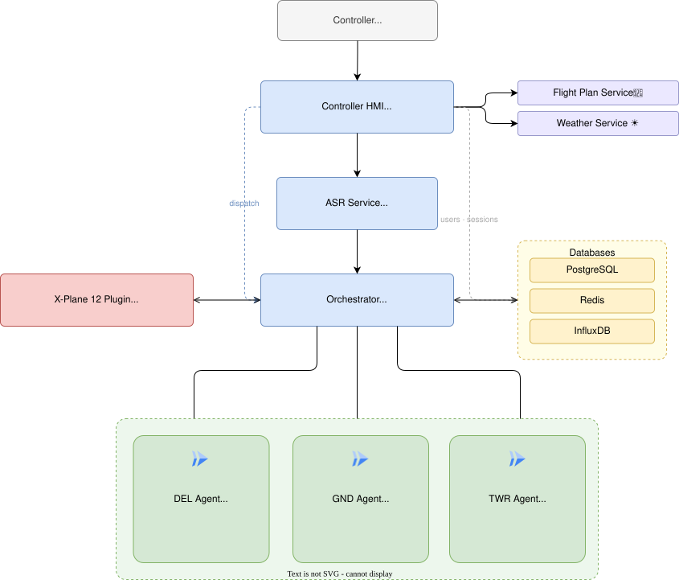

# AIrport -- ATC Training Simulator

<div align="center">


*AI-powered Air Traffic Control training platform. Speak to AI pilots, receive realistic clearances, and watch aircraft move in X-Plane 12.*

</div>

---

## Overview

> **Speak into the mic.** The system transcribes your voice with Whisper-ATC, routes the message to the correct ATC agent (DEL/GND/TWR), generates an ICAO-compliant readback, and moves the aircraft in X-Plane 12 -- voice to taxi clearance in under two seconds.

A central Orchestrator tracks each aircraft's lifecycle through `DEL -> GND -> TWR` and dispatches incoming transmissions to the matching phase agent.

---

## Architecture



### Application services

All FastAPI services. Ports are host-side, exposed by Docker Compose. Other directories under `services/` are placeholders and can be ignored.

| Service | Port | Responsibility |
|---|---|---|
| Controller HMI | 8005 | Web UI (flight strips, ground radar, chat) and API gateway |
| Flight Plan | 8003 | IFR flight plan generation (flightplandatabase.com) |
| Weather | 8004 | METAR, TAF, and ATIS generation |
| ASR | 8006 | Whisper transcription + callsign correction |
| Orchestrator | 8007 | Agent routing, aircraft state machine, dispatch |
| Arrival Simulator | 8008 | Spawns AI arrivals on ILS, drives vacate sequences |

### Infrastructure

| Component | Image | Port (host:container) |
|---|---|---|
| PostgreSQL | `postgres:15-alpine` | 5432:5432 |
| Redis | `redis:7-alpine` | 6379:6379 |
| InfluxDB | `influxdb:2.7-alpine` | 8087:8086 |

---

## ATC Agents

All three agents run on **Google Cloud Run** with Gemini and are stateless. The Orchestrator provides each agent with the relevant aircraft context (flight plan, clearances, weather) on every call. Source under [agents/](agents/).

| Agent | Frequency | Responsibilities |
|---|---|---|
| **DEL** (Clearance Delivery) | DEL | Issues IFR clearances |
| **GND** (Ground Control) | GND | Pushback approval, taxi routes |
| **TWR** (Tower) | TWR | Takeoff / landing clearances, runway sequencing |

---

## Example transmission

```
Controller: "Iberia 5471, taxi to holding point runway 25 via Charlie."
  -> ASR (Whisper ATC)     transcribes audio + corrects callsign -> IBE5471
  -> Orchestrator          routes to GND agent (current phase: GND)
  -> GND agent (Gemini)    validates route in taxi graph, drafts readback
  -> X-Plane plugin        drives aircraft along taxiway C, holds short of 25
Pilot (TTS): "Taxi to holding point runway 25 via Charlie, Iberia 5471."
```

---

## Technology Stack

| Layer | Technology |
|---|---|
| Runtime | Python 3.11, [uv](https://github.com/astral-sh/uv) |
| Web framework | FastAPI + Uvicorn |
| Voice ASR | [faster-whisper](https://github.com/SYSTRAN/faster-whisper) + [Whisper fine-tuned for ATC](https://huggingface.co/jacktol/whisper-medium.en-fine-tuned-for-ATC-faster-whisper) |
| AI agents | google-adk + Gemini (`gemini-3-flash-preview`) on Cloud Run |
| Voice TTS | X-Plane 12 built-in |
| Graph routing | networkx (taxi route graphs) |
| Simulator | X-Plane 12 + [XPPython3](https://xppython3.readthedocs.io/), xplane-airports |
| Data | PostgreSQL 15, Redis 7, InfluxDB 2.7 |
| Containerization | Docker Compose |

---

## Prerequisites

**Local:** Python 3.11, [uv](https://github.com/astral-sh/uv), Docker + Compose v2, X-Plane 12 with [XPPython3](https://xppython3.readthedocs.io/).
**Cloud:** GCP project with Vertex AI enabled, service account JSON with `Vertex AI User`, three Cloud Run agents deployed (DEL / GND / TWR -- see [agents/](agents/)).
**External APIs:** flightplandatabase.com API key.

---

## Installation

```bash
git clone <repo-url> AIrport
cd AIrport
uv sync
cp .env.example .env   # fill credentials -- see docs/configuration.md
docker compose up --build
```

The first run downloads the Whisper ATC model (~1.5 GB) into the `asr_hf_cache` Docker volume. Open the Controller HMI at [http://localhost:8005](http://localhost:8005).

---

## X-Plane Plugin Setup

The in-sim plugin is **not** installed automatically.

1. Install [XPPython3](https://xppython3.readthedocs.io/) into X-Plane 12.
2. Copy the plugin sources into `<X-Plane 12>/Resources/plugins/PythonPlugins/`:
   - [plugins/PI_spawn_obj.py](plugins/PI_spawn_obj.py)
   - the entire [plugins/GND/](plugins/GND/) folder
3. Install pip dependencies into the simulator's bundled Python by running [docs/install/install_dependencies.bat](docs/install/install_dependencies.bat). It wraps [install_xppython3.ps1](docs/install/install_xppython3.ps1), which can also install/update XPPython3 itself.
4. Launch X-Plane 12 and confirm the plugin appears under **Plugins**.
5. Make sure the backend Orchestrator (port `8007`) is running before starting a flight.

---

## Configuration

Full env-var reference -> [docs/configuration.md](docs/configuration.md).

---

## Troubleshooting

| Symptom | Fix |
|---|---|
| Port already in use (5432/6379/8087/8003-8008) | Stop the conflicting local service or remap in `docker-compose.yml` |
| `403 / PERMISSION_DENIED` from Vertex | Grant `Vertex AI User`, re-mount the JSON at `GCP_SA_KEY_PATH` |
| Plugin not showing in X-Plane | Reinstall XPPython3 and confirm files live in `<X-Plane 12>/Resources/plugins/PythonPlugins/` |

Full table -> [docs/troubleshooting.md](docs/troubleshooting.md).

---

## Project Status

| Component | Status |
|---|---|
| ASR (Whisper) | [OK] |
| DEL / GND / TWR agents | [OK] |
| Orchestrator | [OK] |
| Controller HMI (flight strips, ground radar) | [OK] |
| Flight Plan Service | [OK] |
| Weather / ATIS Service | [OK] |
| Arrival Simulator | [OK] |
| TTS (X-Plane built-in) | [OK] |
| X-Plane Plugin (spawn + GND routing) | [OK] |

---

<div align="center">

[License](LICENSE) · [Contributing](CONTRIBUTING.md) · [taxitolearn.com/airport.html](https://taxitolearn.com/airport.html)

*Part of an academic research initiative.*

</div>
