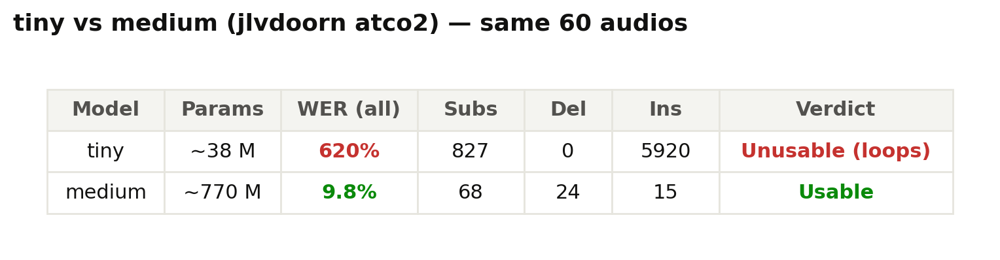
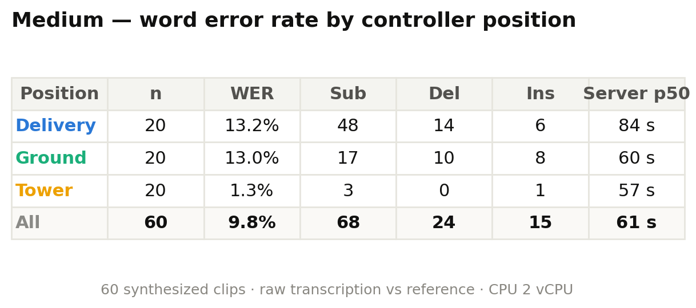
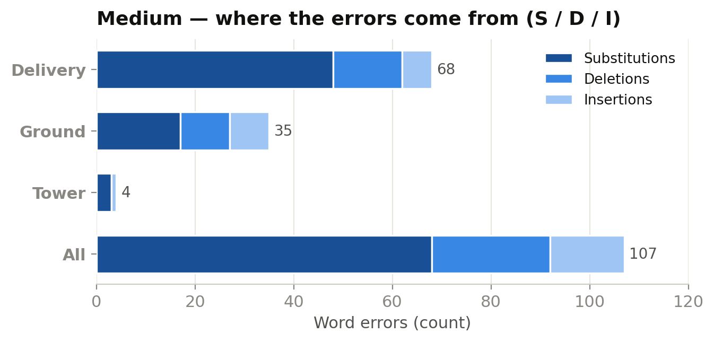
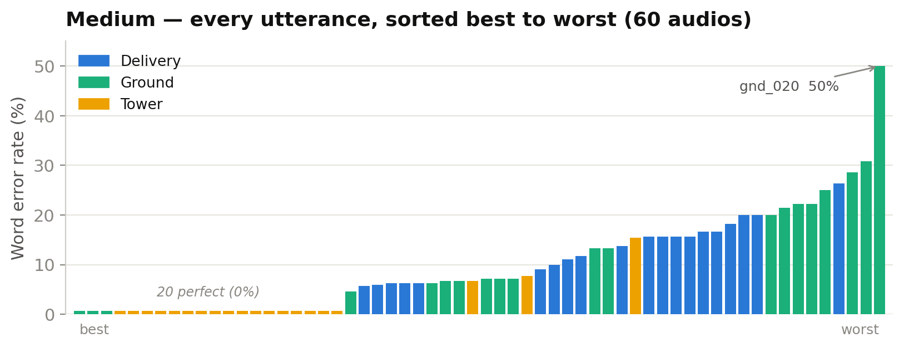
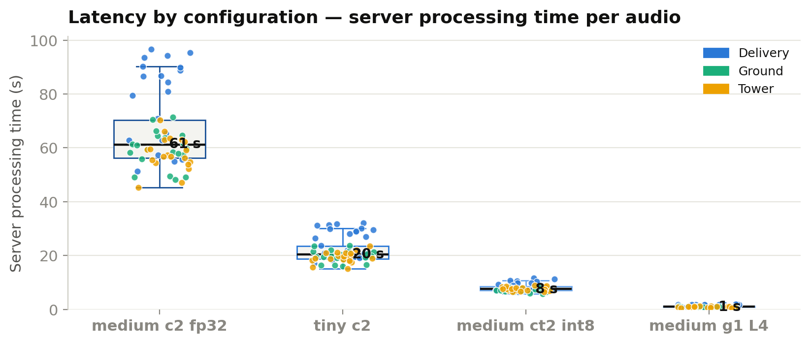
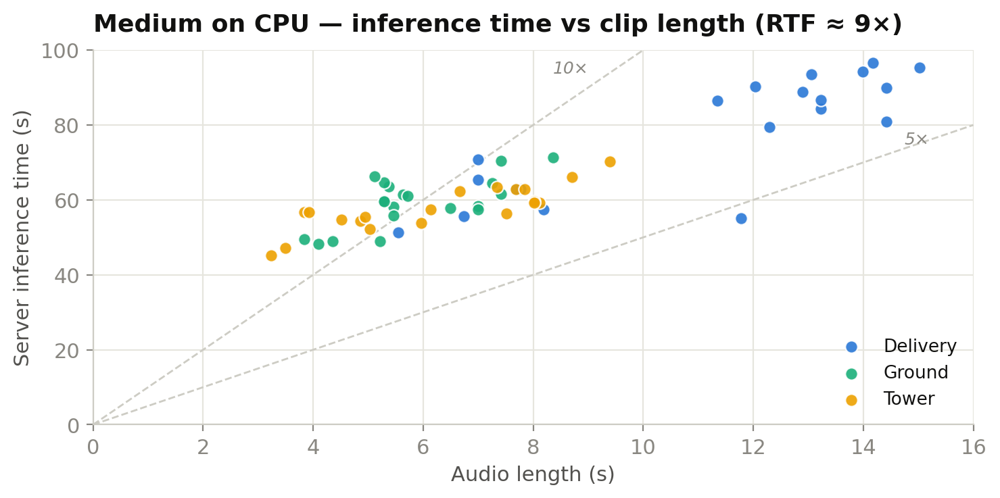
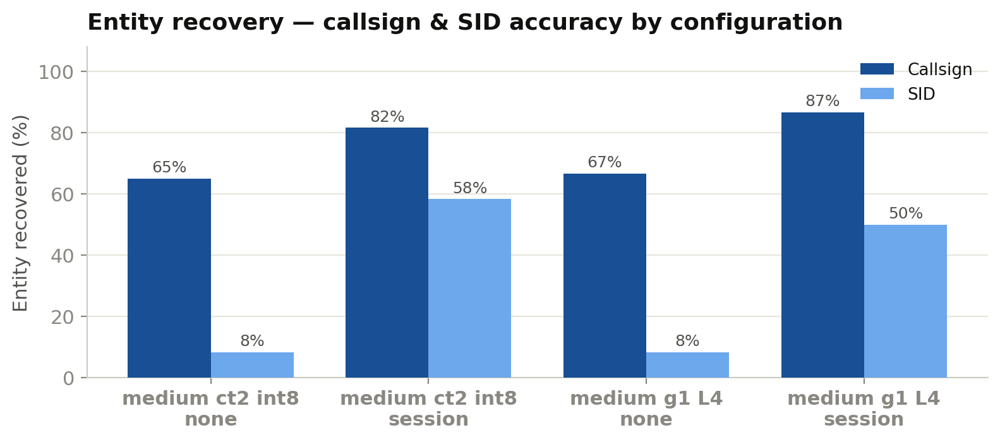
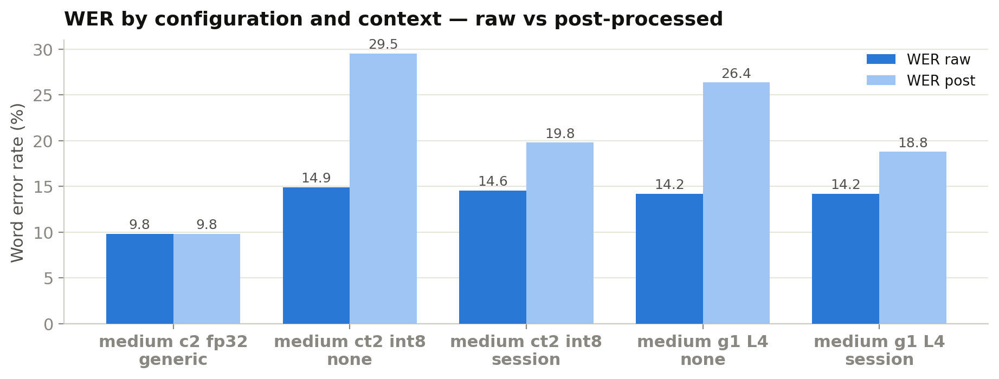

# Benchmark ASR Whisper ATC — Resumen ejecutivo

**Fecha:** 13 de julio de 2026 · **Corpus:** 60 transmisiones de controlador (20 DEL + 20 GND + 20 TWR, 16 kHz mono, repo `pilot-readback-corpus`) · **Servicios:** Cloud Run `europe-west1`, proyecto `airport-490118`

## TL;DR

| Pregunta | Respuesta medida |
|---|---|
| ¿Sirve el modelo tiny? | **No** — 620% WER, alucina en bucle |
| ¿Sirve el medium? | **Sí** — 9.8% WER (fp32) sobre habla ATC |
| ¿Cuánto tarda en CPU básica (2 vCPU)? | 61 s/audio — inviable |
| ¿Y con hardware adecuado? | **1.0 s en GPU L4** (60×) · 8 s en CPU int8 (7×) |
| ¿Ayuda el contexto de sesión (CS+SIDs)? | **Sí, mucho en entidades**: callsigns 65→87%, SIDs 8→58% |
| ¿Coste de la campaña completa? | ≈ $1.50 (240 transcripciones) |

---

## 1. Selección de modelo: tiny vs medium

Mismos 60 audios, misma config (c2: 2 vCPU / 8 GiB, fp32):

El **tiny (~38 M) es inutilizable**: entra en *looping hallucination* (repite un token hasta el límite de generación → 5 920 inserciones). El **medium (~770 M) transcribe casi perfecto**: existe un umbral de tamaño de modelo por debajo del cual el ASR de ATC simplemente no funciona.

### WER del medium por posición de control

- **Tower 1.3%** — fraseología corta y formulaica, casi perfecto.
- Delivery/Ground ~13% — frases largas con SIDs, squawks y frecuencias.

### ¿De dónde vienen los errores?

Dominan las **sustituciones** en Delivery (48/68): palabras difíciles mal mapeadas ("Departure"→"Apache", "BELEN"→"Ville"). No hay pérdida de audio (apenas borrados). Es decir: el error típico es **recuperable con vocabulario de sesión** — motivación directa del experimento de contexto.

20 de 60 locuciones perfectas (0%); la cola la ponen unas pocas de Ground/Delivery (peor caso: gnd_020, 50%).

---

## 2. Latencia: de 61 segundos a 1 segundo

La misma inferencia (medium) sobre cuatro configuraciones de hardware/runtime:

| Config | Runtime | p50/audio | Mejora | Coste/h activo |
|---|---|---|---|---|
| c2 — 2 vCPU / 8 GiB | transformers fp32 | 61 s | — | $0.21 |
| ct2 — 8 vCPU / 32 GiB | **CTranslate2 int8** | **7.5–9 s** | 7× | $0.83 |
| **g1 — GPU NVIDIA L4** | transformers **fp16** | **1.0 s** | **60×** | $1.30 |

- La caja del tiny (20 s) es ilustrativa (tiempos reconstruidos a escala; mediana real medida: 19 s).
- RTF del medium en c2 ≈ 9× (ver `figs/chart_rtf_scatter.png`) — lineal con la duración del clip, sin outliers.

**Conclusión operativa:** para uso en vivo la GPU L4 es la configuración objetivo (~$0.0004/transcripción marginal); el CT2 int8 es la alternativa sin GPU digna (~8 s).

---

## 3. Contexto de sesión: el experimento con/sin

Se compara `context_mode=none` (sin prompt) vs `session` (prompt con callsigns activos + SIDs, y postprocesado con fuzzy + fallback LLM Gemini). Pipeline de corrección: fonético→cifra (squawk/QNH/pista/FL/frecuencias "121.655"), callsign a formato OACI ("Ryanair four seven Bravo"→**RYR47B**), SID canónica (**BELEN1G**), fuzzy contra listas de sesión (umbral 80) y LLM solo si el determinista falla.

### Recuperación de entidades críticas (la métrica que importa en ATC)

| | Callsign correcto | SID correcta |
|---|---|---|
| ct2 · sin contexto | 65% | 8% |
| **ct2 · con sesión** | **82%** | **58%** |
| g1 · sin contexto | 67% | 8% |
| **g1 · con sesión** | **87%** (TWR: 100%) | 42% |

El contexto sube los callsigns **+15–20 pt** y multiplica las SIDs (8%→42–58%). El **fallback LLM** rescató 10/60 casos difíciles en g1 (p. ej. "via NINIX1W departure" con callsign VLG123 correcto).

### WER por configuración y contexto

Nota metodológica: el WER *post* se calcula contra la **referencia normalizada** con el mismo pipeline (comparación justa), lo que encoge el denominador (~2×) e infla el % — por eso la lectura correcta es *post-none vs post-session* (26.4%→18.9% en g1) y, sobre todo, la exactitud de entidades. Un "faced itself" es inofensivo; un callsign mal mapeado es el error peligroso.

---

## 4. Hallazgos técnicos

1. **fp16 tiene coste de calidad**: WER crudo 14.2% en GPU (fp16) vs 9.8% del mismo modelo en fp32-CPU. Trade-off velocidad↔precisión numérica medible; int8-CT2 queda en medio (14.0%).
2. **Bug confirmado — `initial_prompt` no se aplicaba en el backend transformers/GPU**: los `prompt_ids` quedaban en CPU con el modelo en `cuda:0` (`Expected all tensors to be on the same device`) y un fallback silencioso descartaba el prompt. En faster-whisper (ct2) sí funciona — y se nota: su recuperación de SIDs (58%) supera a la de la GPU (42%). *Fix de 1 línea pendiente; re-medir la celda g1-session tras aplicarlo.*
3. **El WER agregado infra-representa la mejora**: la ganancia real del contexto está concentrada en las entidades safety-critical, que el WER diluye entre texto libre.

## 5. Coste

| Concepto | Coste |
|---|---|
| Campaña completa (240 transcripciones, 4 celdas × 60) | ≈ **$1.50** |
| Por transcripción (g1, marginal) | ~$0.0004 |
| Por minuto de audio (c2 / ct2 / g1) | $0.032 / $0.19 / $0.03 aprox. |

Servicios con `min-instances=0` → sin coste en reposo. Borrado seguro por label `campaign=asr-bench`.

## 6. Reproducibilidad

- **Benchmark:** `agents_evaluation/benchmark_asr.py` (`--context none|session`, listas de sesión extraídas del corpus, reintentos con backoff, traza CSV por petición).
- **Figuras:** `scripts/plot_asr_benchmark.py` (multi-config; regenera todo desde los CSV).
- **Datos:** `output/asr_bench/asr_medium_{c2,ct2,g1}_{generic,none,session}.csv` (gitignored).
- **Deploy:** imágenes `asr-medium:{bench,ct2,gpu}` en Artifact Registry `airport`; `Dockerfile.ct2` convierte a CTranslate2 int8 en build; issues de productización: [#40](https://github.com/Santisoutoo/AIrport/issues/40), [#41](https://github.com/Santisoutoo/AIrport/issues/41), [#42](https://github.com/Santisoutoo/AIrport/issues/42).

## 7. Próximos pasos

1. Aplicar el fix del `prompt_ids` en GPU y re-medir `g1-session` (~8 min, ~$0.20).
2. Añadir la celda **large-v3** (imagen GPU ya parametrizada) para completar la curva tamaño↔WER↔latencia.
3. Grabar los 300 audios del corpus completo (100/dependencia) para los IC bootstrap y el test de Wilcoxon del paper.
4. Tablas LaTeX + selección de figuras para la sección Results del paper MDPI (issue #42).
