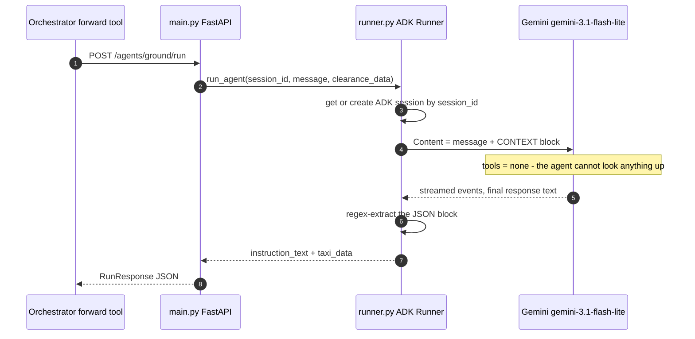

# ATC Agents (DEL / GND / TWR)

Three stateless Gemini pilots, one per controller position, deployed independently to **Google
Cloud Run** — not part of `docker-compose.yml`. Source under [`agents/`](../agents/); the
orchestrator reaches them through `DEL_AGENT_URL` / `GND_AGENT_URL` / `TWR_AGENT_URL`. Called by
the [orchestrator](services/orchestrator_service.md); see the [architecture](architecture.md)
pipeline.

## What it does

These are the pilots on the other side of the radio. One Cloud Run service per controller
position — Delivery, Ground, Tower — each wrapping a single Google ADK `Agent` on Gemini:
stateless Gemini pilots that draft the ICAO readback — nothing more. They don't know what a
controller phase is — that state machine (`APP`/`DEL`/`GND`/`TWR`) lives entirely in PostgreSQL,
owned by the orchestrator; these three are phase-agnostic workers that take a transmission plus
whatever context the orchestrator decided to attach, and hand back a readback.

| Relations | Modules |
|---|---|
| **Called by** | The orchestrator's `forward_to_agent` tool only — the routing brain that decides which aircraft, which controller phase, which pilot agent, and turns the reply into state and motion |
| **Calls** | Gemini (`gemini-3.1-flash-lite`) via Google ADK / Vertex AI — nothing else in the stack |

The call itself is a plain HTTP `POST` — no A2A protocol, no `/tasks/send` handshake.
`forward_to_agent()` is a single `httpx.post()` against `DEL_AGENT_URL` / `GND_AGENT_URL` /
`TWR_AGENT_URL` plus the role's path. (An earlier prototype, `services/pilots_communication/`,
did speak `/tasks/send`; it was never wired into `docker-compose.yml` and isn't part of this
pipeline.)

## One call, one readback

Follow one ground exchange end to end. By the time this call happens, the orchestrator has
already matched the callsign, resolved the phase to GND, and — because this is a taxi
clearance — run the A\* search over the taxiway graph itself; none of that happens inside the
agent.



`main.py` is a thin FastAPI wrapper: the `POST` handler hands the call to `run_agent()` on a
four-worker `ThreadPoolExecutor`, because `runner.py` opens its own event loop with
`asyncio.run()` and a FastAPI handler is already inside one — the same constraint the
orchestrator's own runner works around. Inside `runner.py`, an `InMemorySessionService` keyed by
`session_id` gives the ADK `Runner` a place to keep turn history for a live conversation; it
isn't depended on for facts, since the orchestrator re-attaches full context on every call — a
cold Cloud Run instance with an empty session table produces the same reply. Once Gemini answers,
the runner regexes `\{.*\}` out of the raw text, `json.loads`s it, and pulls the two fields the
prompt's output contract promised.

## Why stateless

The design argument is upstream, not in these services. The orchestrator already merges
PostgreSQL clearances, the flight plan, live Redis state, and — for GND taxi clearances — a
pre-computed A\* route, before it ever calls `forward_to_agent()`. Because all of that lands in
the request body, the pilot agent needs no database connection, no Redis client, and no tool the
way the orchestrator's own routing agent has six. That buys three things: Cloud Run can scale
each agent to zero between transmissions since there's no persistent connection to keep warm;
benchmarking is hermetic — [`benchmark_agents.py`](../agents_evaluation/benchmark_agents.py) can
replay a fixed corpus entry against the live endpoint and get a repeatable grade without standing
up the rest of the stack; and there's no cross-request drift, because nothing about aircraft N's
clearance can leak into aircraft M's readback through shared state.

## The three positions

| Agent | Source | Clears | Receives | Returns |
|---|---|---|---|---|
| **DEL** | [`agents/del/`](../agents/del/) | IFR clearance, pre-pushback | `flight_plan`, `atis` | `clearance_text` + `clearance_data` (squawk, initial_altitude, instrumental_departure, runway_in_use, altimeter, destination_icao) |
| **GND** | [`agents/gnd/`](../agents/gnd/) | Pushback + taxi route | `clearance_data`, incl. `taxi_route.taxiway_sequence` | `instruction_text` + `taxi_data` (pushback_approved, taxi_route, runway_in_use, stand_id, taxi_purpose) |
| **TWR** | [`agents/twr/`](../agents/twr/) | Lineup, takeoff, landing, go-around, handoff to ground | `clearance_data` | `reply_text` + `reply_data` (runway_in_use, sid or frequency) |

*DEL:* "Cleared to Barcelona via DVOR2G departure, maintain 6000 feet, squawk 2341, QNH 1013,
EC-REU." *GND:* "Iberia 123, taxi holding point runway 06R via Bravo, Delta, Echo." *TWR:*
"Runway 32L, cleared for takeoff, NANDO3R departure, EC-REU."

TWR's prompt actually classifies every reply into a `clearance_type` — `takeoff` / `lineup` /
`landing` / `goaround` / `handoff_gnd` / `other` — as a top-level sibling of `reply_text` in the
JSON it's told to emit. `runner.py`, though, only extracts `reply_text` and `reply_data`;
`clearance_type` is parsed and then discarded, and `RunResponse` has no field for it. The
classification logic is real and drives the phrasing, it just never crosses the HTTP boundary
back to the orchestrator today.

## Anatomy of an agent

```
agents/common/                 # single source of truth for the shared code
  agent_runner.py             # build_run_agent(): ADK Runner + sessions + JSON extraction
  agent_app.py                # create_app(): the FastAPI wrapper
agents/<phase>/
  main.py                   # AgentAppConfig + create_app() + the uvicorn entry point
  runner.py                 # AgentRunnerConfig + build_run_agent(), wrapped in a typed run_agent
  agent/agent.py             # Agent(model=AGENT_MODEL, tools=[], instruction=SYSTEM_PROMPT)
  agent/prompts/system.py     # ICAO phraseology rules + the JSON output contract
  agent/tools/                # gnd, twr only - present but empty, nothing registered on the Agent
  shared/agent_runner.py       # vendored copy of agents/common/agent_runner.py
  shared/agent_app.py          # vendored copy of agents/common/agent_app.py
  shared/callbacks.py          # log_before / log_after - a local copy per agent
```

The `shared/` package inside each agent is **vendored**, not imported: every agent is
deployed on its own with `gcloud run deploy --source agents/<phase>`, so the Docker build
context is that one directory (`COPY . .`) and nothing above it exists at runtime. The
generic runner and app factory therefore live once in `agents/common/` and are copied into
all three by [`scripts/sync_agent_common.py`](../scripts/sync_agent_common.py);
`tests/unit/agents/test_agent_common_vendoring.py` fails the suite if a copy drifts. Edit
`agents/common/`, never the copies. `shared/callbacks.py` is the exception — it is not
generated, because each agent's version is tuned to its own state field names.

The prompt in `agent/prompts/system.py` is where all the ATC knowledge actually lives:
message-type classification (a clearance versus a greeting versus "say again"), the exact ICAO
readback phrasing, and the JSON shape the runner expects back. `agent/tools/` exists as an empty
package under GND and TWR — a leftover from an earlier shape. It's not used: the `Agent(...)`
constructor in every `agent/agent.py` passes `tools=[]` explicitly, so nothing is actually
callable from inside the model. `shared/callbacks.py` is duplicated per agent rather than
imported once — one `log_before`/`log_after` pair per file, each tuned to that agent's own field
names (`clearance_data`, `taxi_data`, `reply_data`) for structured before/after-agent logging.
Despite the name, this is not the repo-wide [`shared/`](shared.md) package — it's a same-named,
independent directory local to each agent.

## Deployment and evaluation

Each agent deploys independently with its own `gcloud run deploy`; the walkthrough, required env
vars, and smoke-test `curl` commands are in
[Cloud Agents Deployment](guides/cloud-agents-deployment.md). Quality is tracked outside the
request path: [`benchmark_agents.py`](../agents_evaluation/benchmark_agents.py) replays a
142-entry corpus (42 DEL + 50 GND + 50 TWR) against the live Cloud Run endpoints and reports
latency percentiles plus schema validity per agent; [`validate_agents.py`](../agents_evaluation/validate_agents.py)
goes further, phonetically decoding the expected squawk/altitude/runway out of the ATC text and
comparing it field by field against what the agent actually returned. Both read their corpus from
[`agents_evaluation/corpus_wer/`](../agents_evaluation/corpus_wer/) (`del/`, `gnd/`, `twr/`); see
[data-and-testing](data-and-testing.md) for the rest of the evaluation and test layout.

## Related
[index](index.md) · [architecture](architecture.md) · [orchestrator](services/orchestrator_service.md) · [data-and-testing](data-and-testing.md) · [Cloud Agents Deployment](guides/cloud-agents-deployment.md)
