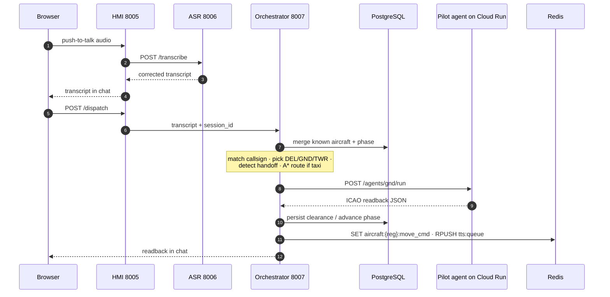
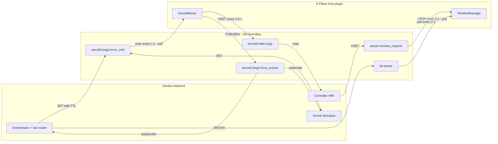
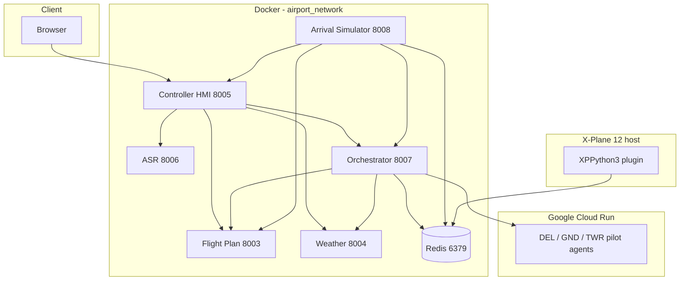
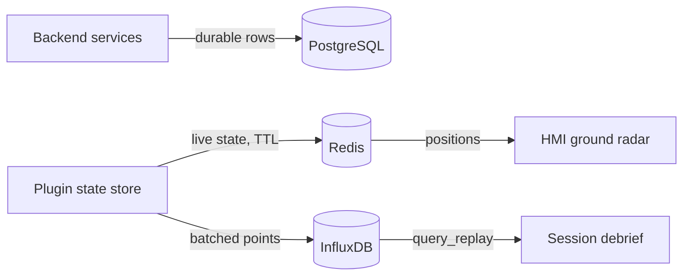

# Architecture

How AIrport works end to end: what happens between the moment the controller presses
push-to-talk and the moment an aircraft moves and answers back inside X-Plane 12. This page is
the hub — every diagram here is referenced from the per-component pages, and each section links
to the page that owns the detail. For the page map, see [index](index.md).

Two ideas organize the whole system:

1. **HTTP inside Docker, Redis across the boundary.** The backend services call each other over
   plain HTTP on the Compose network. The X-Plane plugin runs on the host, inside the simulator,
   and is reached exclusively through Redis: it polls keys for commands and publishes events
   back. Redis is the boundary between the Docker backend and the host-side sim plugin.
2. **The LLM decides, deterministic code executes.** Gemini models decide *which aircraft is
   being addressed* and *what the pilot says back*. Everything safety-shaped — parsing taxiway
   clearances, computing routes, moving the aircraft — is deterministic Python that can be
   unit-tested.

## The voice → motion pipeline

Take one concrete exchange. The controller holds push-to-talk and says: *"Vueling four five
zero two, pushback approved, taxi holding point runway one seven via Bravo."*

1. The browser records the audio and sends it to the [Controller HMI](services/controller_hmi_service.md)
   (port 8005) — the controller's screen, and the single host the browser ever talks to. The HMI
   proxies the audio to the ASR service.
2. The [ASR service](services/asr_service.md) (8006) turns controller speech into corrected ATC
   text: a Whisper model fine-tuned for ATC transcribes, then a correction pass repairs numbers,
   callsigns, SIDs and taxiway letters.
3. The browser shows the transcript and dispatches it — again through the HMI gateway — to the
   [orchestrator](services/orchestrator_service.md) (8007), the routing brain.
4. The orchestrator merges *known aircraft* from three sources — PostgreSQL clearances (the
   authoritative controller phase), the [Flight Plan service](services/flight_plan_service.md),
   and live Redis state — matches the callsign to **VLG4502**, reads its phase (GND), and, since
   this is a taxi clearance, pre-computes an A\* route over the airport taxiway graph.
5. It forwards the message plus context with a plain HTTP POST to the matching
   [pilot agent](agents.md) on Cloud Run — stateless Gemini pilots that draft the ICAO readback,
   nothing more.
6. With the readback in hand, the orchestrator persists what must survive (clearance row, phase
   change) to PostgreSQL, has the [taxi router](shared.md) turn the acknowledged clearance into a
   multi-leg movement plan stored at `aircraft:{reg}:move_cmd`, and RPUSHes the reply text onto
   `tts:queue`.
7. Inside X-Plane, the [plugin](xplane.md) polls Redis: the mover picks up the plan and starts
   the pushback; the window manager pops `tts:queue` and speaks the readback with X-Plane's
   built-in TTS. The controller hears the pilot answer and watches the aircraft comply on the
   ground radar.

The diagram deliberately stops at Redis. What happens on the other side of that boundary is the
next section.

## One boundary, two worlds: Redis

The plugin cannot be a Docker service — it lives inside X-Plane's process on the host. Instead
of exposing an HTTP server in the sim, AIrport gives both worlds one shared Redis and a small
key contract. The crucial design point: **for commands, the plugin polls; it never subscribes.**
The mover scans `aircraft:*:move_cmd` every second, the window manager LPOPs `tts:queue` and
re-reads `airport:session_request` every two seconds. Polling keeps X-Plane's flight loop in
control (no blocking socket callbacks in the render thread) and survives restarts on either side.
Pub/sub flows in the *outbound* direction only: motion milestones on `aircraft:{reg}:move_events`
and chat messages on `hmi:chat`.

## The Redis contract

If you touch Redis anywhere in this repo, this is the contract. Key templates live in
[`shared/services/taxi_router/config.py`](../shared/services/taxi_router/config.py),
[`shared/services/aircraft_state_store.py`](../shared/services/aircraft_state_store.py) and
[`services/orchestrator_service/session_log.py`](../services/orchestrator_service/session_log.py);
`{reg}` is the aircraft registration, `{sid}` the session id.

| Key / channel | Kind | Writer → reader | Purpose |
|---|---|---|---|
| `aircraft:{reg}:move_cmd` | string JSON, TTL | taxi router, arrival sim → plugin mover (1 s scan) | The multi-leg movement plan — the only way anything moves |
| `aircraft:spawn_request:{reg}` | string JSON | arrival sim → plugin mover (deleted after spawn) | Spawn an airborne arrival |
| `tts:queue` | list | orchestrator, arrival event bridge → plugin (2 s LPOP) | Pilot lines to speak in-sim |
| `airport:session_request` | hash | HMI → plugin (2 s poll) | Session start/stop handshake |
| `aircraft:state:{reg}` | hash, TTL 1 h | plugin → HMI radar, taxi router | Live position/heading/speed/phase snapshot |
| `aircraft:active_set` | set | plugin state store → HMI, orchestrator | Registrations currently alive |
| `aircraft:updates` | pub/sub | plugin state store → any listener | Fan-out of every state write |
| `aircraft:{reg}:move_events` | pub/sub | plugin mover → orchestrator, arrival event bridge | Motion milestones (`touchdown`, `reached_end`, …) |
| `hmi:chat` | pub/sub | taxi router → HMI WebSocket, orchestrator log | Pilot-voice rejections and chat lines |
| `aircraft:{reg}:last_error` | string, TTL 5 min | taxi router → humans debugging | Why the last routing attempt failed |
| `airport:current:*` | keys/hashes | plugin airport loader → taxi router, plugin | Parsed airport graph, stands, frequencies, occupancy |
| `airport:asr_config` | hash | HMI login → (legacy) | Stored user API key; the ASR now reads env config |
| `arrivals:assigned` | set | arrival sim | Arrivals already dispatched this session |
| `session:current` | hash | airport data store | Active session metadata |
| `session:{sid}:transcripts` / `:agent_replies` / `:events` | lists, TTL 2 h | orchestrator → debrief builder | Everything said and done, for the debrief |

## Two state machines, not one

Earlier versions of these docs blurred a distinction the code keeps sharp. There are **two**
state machines, owned by different components, living in different stores:

- The **controller-phase state machine** — `APP / DEL / GND / TWR`, stored in the PostgreSQL
  column `aircraft_clearances.dependency`, owned by the orchestrator. It answers *"which
  controller position owns this aircraft right now?"* and only explicit handoff phrases
  ("contact ground", "contact tower") move it. Home:
  [orchestrator](services/orchestrator_service.md).
- The **motion state machine** — `waiting → pushback → taxi_out → done` for departures,
  `approach → landing_roll → vacating → taxi_in → parked` for arrivals, kept per-aircraft inside
  the plugin's mover. It answers *"what is this aircraft physically doing?"*. Home:
  [xplane](xplane.md).

They interact but never merge: a controller handoff does not move the aircraft, and a completed
taxi does not change who owns the frequency.

## Service topology

All backend services are FastAPI + Uvicorn containers defined in
[`docker-compose.yml`](../docker-compose.yml); each exposes a `/health` endpoint used by the
Compose healthchecks. The three pilot agents are **not** in Compose — they deploy independently
to Google Cloud Run and are reached through `DEL_AGENT_URL` / `GND_AGENT_URL` / `TWR_AGENT_URL`.

| Service | Port (host:container) | Talks to (HTTP) |
|---|---|---|
| [Controller HMI](services/controller_hmi_service.md) | 8005:8000 | asr, orchestrator, flight_plan, weather |
| [Flight Plan](services/flight_plan_service.md) | 8003:8000 | flightplandatabase.com (optional) |
| [Weather](services/weather_service.md) | 8004:8000 | aviationweather.gov |
| [ASR](services/asr_service.md) | 8006:8000 | orchestrator (optional server-side dispatch) |
| [Orchestrator](services/orchestrator_service.md) | 8007:8006 | flight_plan, weather, DEL/GND/TWR agents |
| [Arrival Simulator](services/arrival_simulator_service.md) | 8008:8000 | flight_plan, hmi, orchestrator |

## Three data stores, three jobs

| Store | Port | Job |
|---|---|---|
| PostgreSQL `postgres:15-alpine` | 5432:5432 | Durable rows: `users`, `flight_plans`, `atis_broadcasts`, `aircraft_clearances` |
| Redis `redis:7-alpine` | 6379:6379 | Live state + the message bus (the contract above) |
| InfluxDB `influxdb:2.7-alpine` | 8087:8086 | Time series: every aircraft state as measurement `aircraft_state` |

The same aircraft state is written twice on purpose: to Redis for *now* (the radar, the taxi
router) and to InfluxDB for *history* (the post-session debrief replays it). Details:
[shared](shared.md).

## Departure and arrival, side by side

A **departure** is driven by the controller's voice from the first clearance: DEL issues the IFR
clearance, GND approves pushback and taxi (this is where `move_cmd` plans are born), TWR clears
takeoff. The whole chain is exercised end-to-end by
[`tests/integration/test_departure_pipeline.py`](../tests/integration/test_departure_pipeline.py).

An **arrival** is born in software instead: the
[Arrival Simulator](services/arrival_simulator_service.md) spawns it on the ILS and flies it
down; the controller first hears from it at four miles final, clears it to land, and hands it to
ground after vacating — the reverse handoff (`advance_to_gnd_arrival`). End-to-end test:
[`tests/integration/test_arrival_pipeline.py`](../tests/integration/test_arrival_pipeline.py).

## Related

[index](index.md) · [orchestrator](services/orchestrator_service.md) · [agents](agents.md) · [shared](shared.md) · [xplane](xplane.md) · [asr](services/asr_service.md)
