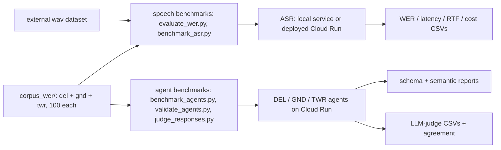

# Data, evaluation & testing

How AIrport checks its own work: offline airport data that seeds the simulator, two benchmark
families that score the ASR and the pilot agents against a hand-written corpus, and the pytest
suite that exercises the deterministic code without touching Redis, PostgreSQL, or an LLM. See
[index](index.md).

## Airport data: data/

Barcelona (LEBL) is the one airport with data checked into the repo, under
[`data/airport_data/LEBL/`](../data/airport_data/LEBL/): the raw apt.dat scenery file
(`LEBL.dat`), a parsed `LEBL_graph.json`, and an interactive `LEBL_airport_map.html`. Two scripts
under [`data/scripts/`](../data/scripts/) produce them. `airport_data_fetcher.py`
(`XPlaneAirportDownloader`) pulls the scenery package straight from the X-Plane Scenery Gateway
via the `xplane-airports` package — `downloader.download()` writes `airport_data/{ICAO}/{ICAO}.dat`.
`airport_graph_builder.py` (`AirportMapVisualizer`) then parses the same apt.dat row codes the
plugin understands — `100` runways, `1201`/`1202` taxi nodes and edges, `1300` stands — and
renders them as a layered Folium map; a `get_graph_data()` method exposes the same parsed
elements as a plain dict for notebook use.
[`data/notebooks/visualization.ipynb`](../data/notebooks/visualization.ipynb) drives this
visualizer interactively.

It's tempting to assume this is where the taxiway graph `taxi_router` actually routes over comes
from — it isn't. Every session re-parses the current airport's apt.dat from scratch at runtime:
the plugin's `data_parser.py` and `graph.py` build the graph fresh and write it into Redis under
`airport:current:*` (see [xplane](xplane.md)). The `LEBL_graph.json` checked into `data/` gives
the game away once you compare shapes — its nodes carry a `usage` field that matches the plugin's
`TaxiNode`, not `get_graph_data()`'s output — so it's an offline snapshot for analysis, not a
build input consumed by anything at runtime.

Repo-root [`scripts/`](../scripts/) holds the plotting utilities that turn benchmark and log
output into figures, mostly for the thesis write-up: `plot_airport_routes.py` renders airport
plans with sample routes; `plot_lest_graph.py`, `plot_lest_routes.py` and
`overlay_lest_routes_on_image.py` do the same for a second airport, LEST, whose source data isn't
checked into `data/` — the last one homography-warps the routes onto a real X-Plane screenshot;
`analyze_pipeline_log.py` extracts per-stage latencies from `logs/pipeline.log`;
`plot_agent_benchmark.py` charts the agent benchmark below; and the newest,
`plot_asr_benchmark.py`, renders the ASR benchmark CSVs into WER/RTF/latency figures under
`output/asr_bench/figs/`.

## Measuring the AI: agents_evaluation/

Two independent benchmark families live in [`agents_evaluation/`](../agents_evaluation/), and both
draw on the same corpus: [`corpus_wer/`](../agents_evaluation/corpus_wer/) holds a `del/`, `gnd/`
and `twr/` subfolder, each with a `corpus_wer_*.txt` of 100 hand-written exchanges (300 total) — a
`>` controller transmission and a `<` expected ICAO pilot readback per entry, format documented in
[`corpus_wer/README.md`](../agents_evaluation/corpus_wer/README.md).

**Speech** asks how well the ASR — which turns controller speech into corrected ATC text — hears.
[`evaluate_wer.py`](../agents_evaluation/evaluate_wer.py) is the local loop: it transcribes every
corpus `.wav` through a live ASR endpoint and scores `jiwer` WER against the reference line, and
optionally replays the DEL hypotheses through the orchestrator as a smoke test.
[`benchmark_asr.py`](../agents_evaluation/benchmark_asr.py) (new) targets the deployed Cloud Run
ASR instead: stdlib-only, with its own word-level Levenshtein aligner (substitutions, deletions,
insertions — no `jiwer`), it reports micro- and macro-averaged WER both raw and after
canonicalisation (numbers, callsigns and SIDs folded to coded form, reusing the service's own
`core.postprocess` when importable), plus server-side latency, RTF, and estimated cost from
`--cost-per-h`. Three `--context` modes (`none` / `generic` / `session`) exercise the service's
fuzzy entity matcher, the last feeding it per-session callsign/SID vocabularies pulled straight
from the corpus. Audio is referenced from an external `pilot-readback-corpus` checkout, never
copied into this repo. Results land under `output/asr_bench/` (a different tree from
`agents_evaluation/output/` below) and are charted by
[`plot_asr_benchmark.py`](../scripts/plot_asr_benchmark.py).

**Agents** asks how well the pilots answer. Each DEL/GND/TWR endpoint is one of the stateless
Gemini pilots that draft the ICAO readback — nothing more — so grading them means grading the
reply itself. [`benchmark_agents.py`](../agents_evaluation/benchmark_agents.py) posts every corpus
line to its matching Cloud Run endpoint and checks latency, HTTP status, and whether the
structured block (`clearance_data` / `taxi_data` / `reply_data`) carries every required field.
[`validate_agents.py`](../agents_evaluation/validate_agents.py) goes deeper, regex-decoding the
expected values straight out of the phonetic ATC text (squawk, SID, runway, QNH, destination…)
and comparing them field-by-field against the agent's response, three dependency workers running
in parallel. Newest of all: [`judge_responses.py`](../agents_evaluation/judge_responses.py) runs
an LLM-as-judge pass — `gemini-2.5-pro` on Vertex scores each reply against the transmission and
reference readback on five axes (values correct, complete, no hallucination, phraseology 1-5,
overall) — and [`judge_agreement.py`](../agents_evaluation/judge_agreement.py) turns a
hand-labelled sample of the judge's verdicts into a Cohen's-kappa reliability figure for it.

## The pytest suite

Config lives in [`pyproject.toml`](../pyproject.toml)'s `[tool.pytest.ini_options]`:
`asyncio_mode = "auto"`, `testpaths = ["tests"]`, `pythonpath` extended with the orchestrator and
arrival-simulator service roots so their modules import bare, and a coverage gate of
`fail_under = 70` scoped to a specific `source` list (the orchestrator's agent/api/db layers, the
arrival-simulator core modules, `shared/services/taxi_router`) rather than the whole repo. What
makes the deepest tests possible is [`tests/fixtures/`](../tests/fixtures/):
[`fake_redis.py`](../tests/fixtures/fake_redis.py) is a synchronous in-memory stand-in for the
Redis commands the code actually uses (KV, hash, set, list, pub/sub, pipelines),
[`fake_db.py`](../tests/fixtures/fake_db.py) builds a per-test SQLite `:memory:` engine from the
real SQLAlchemy `Base.metadata`, and [`adk_runner.py`](../tests/fixtures/adk_runner.py)'s
`FakeADKRunner` scripts what the Gemini agent runner would yield without ever calling an LLM.
Wired together in one fixture, these three fakes let even
[`tests/integration/test_departure_pipeline.py`](../tests/integration/test_departure_pipeline.py)
and [`test_arrival_pipeline.py`](../tests/integration/test_arrival_pipeline.py) run the full
clearance-to-Redis-write pipeline hermetically — no simulator, no cloud call, no open network
socket anywhere in the run.

| Area | Path | Covers |
|---|---|---|
| Departure/arrival e2e | [`tests/integration/`](../tests/integration/) | full pipeline over the three fakes |
| Orchestrator units | [`tests/unit/orchestrator/`](../tests/unit/orchestrator/) | dispatch, advance tools, arrivals endpoint, events subscriber, forward tool, frequency audit, known-aircraft tool, taxi-route tool, repository, runner, session log |
| Arrival simulator units | [`tests/unit/arrival_simulator/`](../tests/unit/arrival_simulator/) | event bridge |
| Taxi routing | [`tests/taxi_router/`](../tests/taxi_router/) | graph construction, token resolution, routing e2e, pushback leg, HMI chat |
| Arrivals | [`tests/arrivals/`](../tests/arrivals/) | phases, runway config, arrival planner, geo |
| Debrief | [`tests/debrief/`](../tests/debrief/) | debrief builder |

Run with `uv run pytest` (or plain `pytest`). The honest gap sits outside this table entirely:
`xplane_plugin/` — the in-sim motion engine — appears nowhere in the coverage `source` list and
has no unit tests of its own. The mover's state machine is exercised only indirectly, through the
integration fakes above and manual sessions inside X-Plane.

## Related
[architecture](architecture.md) · [agents](agents.md) · [asr](services/asr_service.md) · [xplane](xplane.md) · [index](index.md)
