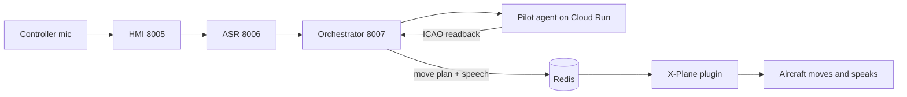

# AIrport Wiki

> This wiki serves two audiences. **Users**: start with the [Guides](#guides) —
> installation, configuration, troubleshooting, and a quickstart. **Developers and coding
> agents**: the [reference pages](#reference-pages) are structured for finding repo context
> fast — narrative "how it works" sections, diagrams, and cross-links. Prose docs under
> [`docs/`](../docs/) now point here; the wiki guides are the maintained versions.

## What is AIrport

AIrport is an AI-powered ATC training simulator on X-Plane 12 — the human is the controller,
the AI plays the pilots. You key the mic and speak real ICAO phraseology; a Whisper model
fine-tuned for ATC transcribes you; a Gemini **orchestrator** works out which aircraft and
which controller position (Delivery / Ground / Tower) you addressed; a stateless Gemini
**pilot agent** drafts the readback; and the **X-Plane plugin** makes it real — the aircraft
pushes back, taxis, lands, and answers you over the speakers.

Stack in one sentence: Python 3.11 (`uv`-managed) FastAPI microservices on Docker Compose,
Google ADK + Gemini pilot agents on Cloud Run, an XPPython3 plugin inside the sim, and
PostgreSQL / Redis / InfluxDB underneath — with Redis as the boundary between the Docker
backend and the host-side sim plugin. See [`README.md`](../README.md) for the human-facing
project overview.

## The sixty-second tour

1. The browser records push-to-talk audio and sends everything through the
   [Controller HMI](services/controller_hmi_service.md) — the controller's screen, and the
   single host the browser ever talks to.
2. The [ASR service](services/asr_service.md) turns controller speech into corrected ATC text.
3. The [orchestrator](services/orchestrator_service.md) — the routing brain — matches the
   callsign, picks the controller phase, and routes the message.
4. A [pilot agent](agents.md) on Cloud Run drafts the ICAO readback — nothing more.
5. The orchestrator turns the acknowledged clearance into state and motion: a clearance row in
   PostgreSQL, a movement plan and a speech line in Redis (via the
   [shared taxi router](shared.md)).
6. The [X-Plane plugin](xplane.md) polls Redis, moves the aircraft, and speaks the readback —
   everything inside the simulator: spawn, move, speak.

The full walkthrough with the sequence diagram, the Redis key contract, and the topology lives
in [architecture.md](architecture.md).

## Guides

Human-facing, hand-maintained pages (source: [`guides/`](guides/) — not auto-generated; see
[Wiki Maintenance](guides/wiki-maintenance.md)).

| Guide | Covers |
|---|---|
| [Installation](guides/installation.md) | Zero → running stack: prerequisites, `.env`, `docker compose up`, verifying every service |
| [Cloud Agents Deployment](guides/cloud-agents-deployment.md) | Deploying the DEL/GND/TWR pilot agents to Google Cloud Run |
| [X-Plane Plugin Setup](guides/xplane-plugin-setup.md) | Installing XPPython3 + the AIrport plugin into X-Plane 12 |
| [Configuration](guides/configuration.md) | Complete environment-variable reference, host vs container ports |
| [Quickstart](guides/quickstart.md) | Run your first ATC session end to end |
| [Troubleshooting](guides/troubleshooting.md) | Symptom → cause → fix, organized by area |
| [FAQ](guides/faq.md) | GPU vs CPU ASR, degraded modes, airports, models & datasets, license |
| [System Overview](guides/system-overview.md) | Every module, what it does, and how they relate |
| [Wiki Maintenance](guides/wiki-maintenance.md) | How this wiki is generated and published — never edit it by hand |

## Reference pages

| Page | Covers |
|---|---|
| [architecture.md](architecture.md) | The hub: voice→motion pipeline, the Redis boundary and key contract, the two state machines, topology, data stores |
| [services/orchestrator_service.md](services/orchestrator_service.md) | The routing brain — decides which aircraft, which controller phase, which pilot agent, and turns the reply into state and motion |
| [agents.md](agents.md) | Stateless Gemini pilots that draft the ICAO readback — nothing more |
| [services/asr_service.md](services/asr_service.md) | Turns controller speech into corrected ATC text |
| [services/controller_hmi_service.md](services/controller_hmi_service.md) | The controller's screen, and the single host the browser ever talks to |
| [services/arrival_simulator_service.md](services/arrival_simulator_service.md) | Keeps AI arrivals coming down the ILS so the controller always has traffic |
| [services/flight_plan_service.md](services/flight_plan_service.md) | Generates and stores the IFR flight plans that give every aircraft its identity |
| [services/weather_service.md](services/weather_service.md) | Fetches real METAR/TAF and generates the ATIS the whole session keys off |
| [shared.md](shared.md) | The backend's common library — models, geo, state stores, and the A\* taxi router |
| [xplane.md](xplane.md) | Everything inside the simulator: spawn, move, speak |
| [data-and-testing.md](data-and-testing.md) | LEBL airport data, the speech and agent benchmarks, and the pytest suite |

## Services and infrastructure

Active services, wired into [`docker-compose.yml`](../docker-compose.yml). Ports are
`host:container`; every service exposes `/health`.

| Service | Port | One-line role |
|---|---|---|
| [Controller HMI](services/controller_hmi_service.md) | 8005:8000 | Web UI + API gateway |
| [Flight Plan](services/flight_plan_service.md) | 8003:8000 | IFR flight plan generation (external API with full local fallback) |
| [Weather](services/weather_service.md) | 8004:8000 | METAR/TAF fetch + ATIS generation |
| [ASR](services/asr_service.md) | 8006:8000 | Whisper transcription + ATC text correction |
| [Orchestrator](services/orchestrator_service.md) | 8007:8006 | Routing, phase state machine, dispatch, debrief |
| [Arrival Simulator](services/arrival_simulator_service.md) | 8008:8000 | Spawns and flies AI arrivals on the ILS |

| Infrastructure | Image | Port |
|---|---|---|
| PostgreSQL | `postgres:15-alpine` | 5432:5432 |
| Redis | `redis:7-alpine` | 6379:6379 |
| InfluxDB | `influxdb:2.7-alpine` | 8087:8086 |

The three pilot agents (**DEL**, **GND**, **TWR** — see [agents.md](agents.md)) are not in
Compose; they deploy independently to **Google Cloud Run** and are reached via
`DEL_AGENT_URL` / `GND_AGENT_URL` / `TWR_AGENT_URL`.

## Not part of the running system

| Directory | State |
|---|---|
| `services/analytics_service/`, `services/nlp_service/`, `services/xplane_manager/` | Empty placeholders — only a `.gitkeep` |
| `services/tts_service/` | Empty placeholder — speech actually happens in the sim: the plugin's window manager drains `tts:queue` into X-Plane's built-in TTS (see [xplane.md](xplane.md)) |
| `services/database/` | A scratch Redis test script, not a service |
| `transcription/` (repo root) | Superseded prototype of the [ASR service](services/asr_service.md) — real code, not in Compose |
| `services/pilots_communication/` | Superseded prototype of what ASR + orchestrator now do together — real code, not in Compose |

## Related

[architecture.md](architecture.md) · [agents.md](agents.md) · [shared.md](shared.md) · [xplane.md](xplane.md) · [data-and-testing.md](data-and-testing.md)
