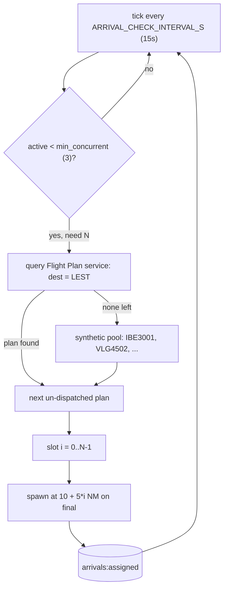
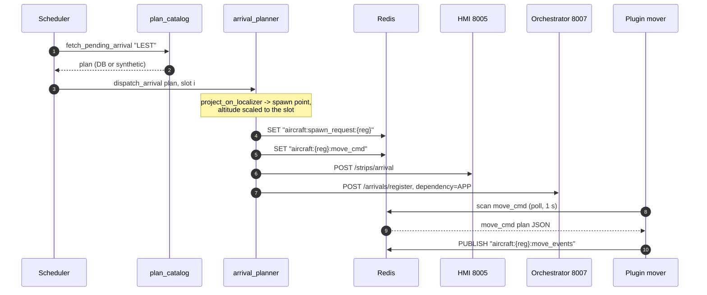

# Arrival Simulator Service

**Port 8008:8000** · [`services/arrival_simulator_service/`](../../services/arrival_simulator_service/) ·
keeps AI arrivals coming down the ILS so the controller always has traffic. Health:
`/api/v1/arrivals/health`. See [architecture](../architecture.md).

## What it does

Keeps AI arrivals coming down the ILS so the controller always has traffic: an asyncio scheduler
tops up a pool of simultaneous arrivals, builds each one's spawn point and multi-leg flight plan,
and hands it to the same plugin mover that flies taxi clearances. A second task listens for what
the mover reports back and turns two of its milestones into pilot radio calls, so the controller's
first contact with an arrival is geometry-triggered: 4 NM out.

| Relations | Modules |
|---|---|
| **Called by** | the X-Plane plugin's in-sim UI — `POST /api/v1/arrivals/restart` on session start (host port 8008, triggered when it reads `airport:session_request` from Redis) · `/start`, `/stop`, `/active` for manual/Swagger use |
| **Calls** | [Flight Plan](flight_plan_service.md) (`GET /plans`, arrivals into LEST) · [Controller HMI](controller_hmi_service.md) (`POST /strips/arrival`) · [Orchestrator](orchestrator_service.md) (`POST /arrivals/register`) · Redis (spawn, move, events, tts) |

**Try it standalone:** <http://localhost:8008/docs> · health `GET /api/v1/arrivals/health` ·
`POST /api/v1/arrivals/start` — tuning knobs in
[Configuration](../guides/configuration.md#arrival-simulator-prefix-arrival_).

## The slot machine: keeping arrivals on final

Nothing runs until something calls `/start` or `/restart` — unlike most of AIrport's backend, this
service sits idle by default. Once running, `ArrivalScheduler._run_loop` wakes up every
`ARRIVAL_CHECK_INTERVAL_S` (default 15 s), compares how many registrations are currently tracked as
active against `ARRIVAL_MIN_CONCURRENT` (default 3), and — this is the detail that earns the "slot
machine" name — dispatches *all* of the shortfall in the same tick, not one per tick. If three
arrivals land and vacate close together, the very next check spawns three replacements at once,
staggered along the localizer at `ARRIVAL_SPAWN_DISTANCE_NM + slot_index * ARRIVAL_SLOT_SEP_NM`
(10, 15, 20 NM by default) so they don't stack on top of each other on final.

Each dispatch pulls its aircraft from `plan_catalog.fetch_pending_arrival`: first choice is any
plan from the [Flight Plan service](flight_plan_service.md) — which generates and stores the IFR
flight plans that give every aircraft its identity — whose `destination_ICAO` is the session
airport and isn't already spoken for; failing that, a built-in synthetic pool of six aircraft
(IBE3001, VLG4502, RYR7810, IBE3045, VLG4610, RYR5521) cycles indefinitely, so the simulator works
with zero flight-plan setup. Either way, the registration lands in the Redis set
`arrivals:assigned` the moment it's dispatched, so the catalog never repeats an aircraft in one
session. `/start` also purges `aircraft:spawn_request:*` and synthetic-pool `move_cmd` keys left
from the last run, so nothing ghost-spawns at stale coordinates. `GET /active` exposes exactly what
the scheduler is tracking — handy for debugging a session that feels traffic-starved.

## Birth of an arrival

`arrival_planner.dispatch_arrival` turns one catalog plan into a live aircraft: it projects the
spawn point on the extended runway centerline with
[`shared/services/geo.py`](../../shared/services/geo.py)'s
`project_on_localizer(threshold_lat, threshold_lon, heading_deg, distance_nm)`, then scales the
spawn altitude proportionally to distance so every staggered slot rides the same descent gradient
to the threshold — documented as a 3° glideslope, though the shipped numbers (5,000 ft AGL at 10
NM, -1,333 fpm at 160 kt) actually compute closer to 4.7°, per the module's own comment.

Two Redis keys follow — this service's only way across the boundary between the Docker backend and
the host-side sim plugin. `aircraft:spawn_request:{reg}` tells the plugin to spawn the
aircraft airborne at that point (and is deleted once it does); `aircraft:{reg}:move_cmd` is the
same three-leg plan shape the taxi router writes for departures — `approach` (descend to the
threshold, firing a `request_landing` event at `ARRIVAL_REQUEST_AT_NM`, 4 NM by default),
`landing_roll` (decelerate down the centerline to a taxi speed), and `vacate` (two waypoints: abeam
the exit, then a sharp turn onto taxiway E3) — the same **motion state machine** the plugin tracks
per aircraft, detailed in [xplane](../xplane.md). The mover that picks this up flies the plan and
publishes milestones on `aircraft:{reg}:move_events`; it doesn't know or care that the plan came
from the arrival simulator instead of the taxi router — one contract, two writers, full key list in
[architecture](../architecture.md).

Two HTTP calls close out the dispatch. One registers a virtual strip in the
[Controller HMI](controller_hmi_service.md) — the controller's screen, and the single host the
browser ever talks to — so the arrival shows up in the ARRIVALS column despite no controller ever
having created it. The other registers the aircraft with the
[orchestrator](orchestrator_service.md) — the routing brain — at `dependency='APP'`, seeding the
**controller-phase state machine** with an aircraft it never cleared. That row is the only reason
"contact ground" later resolves as a valid handoff instead of an unknown callsign.

One hard-coded seam: every arrival flies LEST runway 17 geometry (threshold, ~166° heading, the E3
vacate exit) from `runway_config.py`; `get_active_runway` raises for any other ICAO. Most of
AIrport is written to be multi-airport — this service currently isn't.

## Listening back: the event bridge

`event_bridge.py` is the one part of this service that subscribes instead of polling — it runs
alongside the scheduler as its own task and `psubscribe`s to `aircraft:*:move_events`, the same
pattern the orchestrator listens to for every aircraft in the sim. A small in-memory map, filled by
`register_arrival()` right after dispatch, is how it tells its own arrivals apart from ordinary
departure taxi traffic on that same channel; anything it didn't dispatch itself is ignored.

Three milestones matter. At `request_landing` — fired by the mover once the aircraft crosses
`ARRIVAL_REQUEST_AT_NM` (4 NM final) — the bridge builds "Tower, {callsign}, {N} miles final runway
17, request landing." and RPUSHes it onto `tts:queue`, where the plugin speaks it and the
controller hears the check-in. At `rolling_out` it pushes "{callsign} vacating runway 17." At
`reached_end` — the vacate leg's last waypoint — it unregisters the aircraft and calls back into
`scheduler.remove_arrival()`, which drops the registration from the active set. That's the slot the
next scheduler tick sees as a shortfall and refills: spawn, fly, event, slot freed, spawn again.

The scheduler's tick is timer-driven; the pilot's first radio call is not — `request_landing`
fires the instant the mover's distance-to-threshold crosses 4 NM, on whatever cadence the aircraft
actually flew.

## Tuning knobs

`POST /start` and `/restart` also accept an optional `min_concurrent` JSON field that overrides
`ARRIVAL_MIN_CONCURRENT` for that run; the plugin's own session-start call sends no body, so in
practice the env default governs every session today.

| Env var | Default | Controls |
|---|---|---|
| `ARRIVAL_MIN_CONCURRENT` | `3` | Target simultaneous arrivals |
| `ARRIVAL_CHECK_INTERVAL_S` | `15.0` | Scheduler tick |
| `ARRIVAL_SPAWN_DISTANCE_NM` / `ARRIVAL_SLOT_SEP_NM` | `10.0` / `5.0` | Base spawn distance and per-slot stagger on the localizer |
| `ARRIVAL_SPAWN_ALT_AGL_FT` | `5000.0` | AGL height at the base spawn distance |
| `ARRIVAL_IAS_KTS` / `ARRIVAL_VS_FPM` | `160.0` / `-1333.0` | Approach speed and descent rate |
| `ARRIVAL_REQUEST_AT_NM` | `4.0` | Distance that fires `request_landing` |
| `ARRIVAL_DECEL_KTS_S` / `ARRIVAL_STOP_KTS` | `4.0` / `20.0` | Landing-roll deceleration and end speed |
| `ARRIVAL_VACATE_KTS` | `15.0` | Taxi speed off the runway |

Full defaults and the rest of the prefix live in
[Configuration](../guides/configuration.md#arrival-simulator-prefix-arrival_). One env var is a
trap: `ARRIVAL_INTERVAL_S` (default `120`) is still set in `docker-compose.yml`, but nothing in
`core/` reads it — it predates the current min-concurrent scheduler, and the cadence that actually
governs today is `ARRIVAL_CHECK_INTERVAL_S`.

## Layout and tests

| Path | Role |
|---|---|
| [`main.py`](../../services/arrival_simulator_service/main.py) | FastAPI entrypoint; stops the scheduler on shutdown |
| [`api/routes.py`](../../services/arrival_simulator_service/api/routes.py) | `/health`, `/start`, `/restart`, `/stop`, `/active` |
| [`core/scheduler.py`](../../services/arrival_simulator_service/core/scheduler.py) | The tick loop and active-arrival bookkeeping |
| [`core/arrival_planner.py`](../../services/arrival_simulator_service/core/arrival_planner.py) | Builds and dispatches one arrival's spawn + move plan |
| [`core/plan_catalog.py`](../../services/arrival_simulator_service/core/plan_catalog.py) | Picks the next un-dispatched plan (DB or synthetic) |
| [`core/event_bridge.py`](../../services/arrival_simulator_service/core/event_bridge.py) | Subscribes to move events; drives TTS and slot release |
| [`core/runway_config.py`](../../services/arrival_simulator_service/core/runway_config.py) | Fixed LEST RWY 17 geometry |

No separate `config.py` — every env var above is read inline where it's used, in `scheduler.py` and
`arrival_planner.py`. Tests: [`tests/arrivals/`](../../tests/arrivals/) covers the planner's
geometry, [`tests/unit/arrival_simulator/`](../../tests/unit/arrival_simulator/) covers the event
bridge, and
[`tests/integration/test_arrival_pipeline.py`](../../tests/integration/test_arrival_pipeline.py)
exercises the whole spawn-to-vacate chain end to end.

## Related
[architecture](../architecture.md) · [xplane](../xplane.md) · [flight_plan](flight_plan_service.md) · [orchestrator](orchestrator_service.md) · [index](../index.md)
