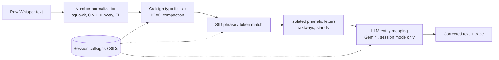
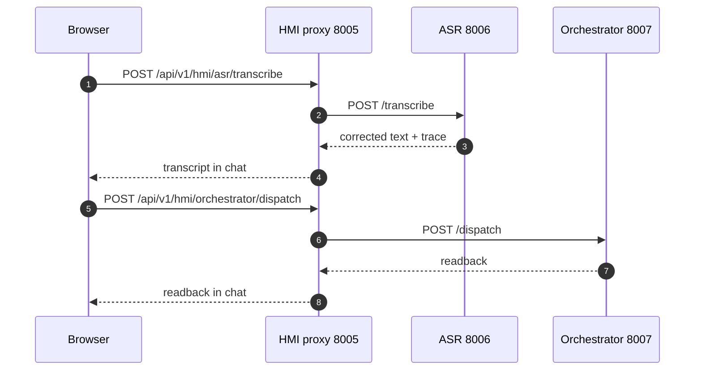

# ASR Service

**Port 8006:8000** · [`services/asr_service/`](../../services/asr_service/) · speech-to-text and
correction for controller transmissions. Health: `/api/v1/asr/health`. See
[architecture](../architecture.md).

## What it does

The ASR service **turns controller speech into corrected ATC text**: a push-to-talk recording
lands on `/api/v1/asr/transcribe`, a Whisper model fine-tuned for ATC transcribes it, a four-stage
deterministic pipeline repairs numbers, callsigns, SIDs and taxiway letters, and an optional Gemini
pass mops up whatever the deterministic pass couldn't confidently resolve.

| Relations | Modules |
|---|---|
| **Called by** | Controller HMI proxy — browser push-to-talk audio, forwarded byte-for-byte via `/api/v1/hmi/asr/transcribe` |
| **Calls** | [Orchestrator](orchestrator_service.md) `/dispatch` — optional, only when `ORCHESTRATOR_URL` is set · Gemini on Vertex AI — LLM entity-mapping fallback |

## From audio to ATC text

[`api/transcribe_service.py`](../../services/asr_service/api/transcribe_service.py) picks the
inference backend from the configured model ID via `core.config.get_model_backend`
([`core/config.py`](../../services/asr_service/core/config.py)): the default,
`jacktol/whisper-medium.en-fine-tuned-for-ATC-faster-whisper`, runs on `faster-whisper`/CTranslate2
(`int8` on CPU by default — `ASR_WHISPER_DEVICE`, `ASR_WHISPER_COMPUTE_TYPE`); the other four
models on the menu run through a HuggingFace `transformers` speech-recognition pipeline instead.
Either way, inference runs inside a two-worker `ThreadPoolExecutor` via `loop.run_in_executor`,
keeping the event loop free while the model call blocks a worker thread instead.

| Model ID | Backend |
|---|---|
| `jacktol/whisper-medium.en-fine-tuned-for-ATC-faster-whisper` (default) | faster-whisper |
| `jacktol/whisper-large-v3-finetuned-for-ATC` | transformers |
| `jlvdoorn/whisper-tiny-atco2-asr` | transformers |
| `jlvdoorn/whisper-medium-atco2-asr` | transformers |
| `jlvdoorn/whisper-large-v3-atco2-asr` | transformers |

Before transcribing, [`api/routes.py`](../../services/asr_service/api/routes.py) builds a Whisper
`initial_prompt` from [`prompts/whisper_context.py`](../../services/asr_service/prompts/whisper_context.py)'s
`ATC_PROMPT` — realistic ATC exchanges rather than a word list, since Whisper continues the *style*
it's shown. Three `context_mode` values shape it: `none` sends no prompt at all; `generic` (the
default) sends `ATC_PROMPT` unchanged; `session` appends whatever `session_callsigns`/`session_sids`
the caller supplied as two extra sentences ("Active callsigns: ...", "Expected SIDs: ..."). Setting
`use_initial_prompt=False` suppresses the prompt regardless of mode, kept for backward
compatibility.

All of those switches arrive as multipart form fields alongside the audio, and they are grouped in
`TranscribeOptions` ([`api/schemas.py`](../../services/asr_service/api/schemas.py)) rather than
listed one by one on the handler; `audio` stays a plain `UploadFile`. The model also owns the
JSON-array-or-CSV parsing of `session_callsigns`/`session_sids` (`options.callsigns`,
`options.sids`). Field names, defaults and the multipart contract are unchanged.

## The correction pipeline

`api/routes.py` hands the raw Whisper string to
[`core/postprocess.py`](../../services/asr_service/core/postprocess.py)'s
`postprocess_transcription`, four deterministic stages that run in a fixed order because each one
depends on what the last left alone:

1. **Numbers** (`normalize_numbers`) — phonetic digits become figures only inside known ATC
   contexts (`squawk`, `QNH`, `runway`, climb/altitude "... thousand", `flight level`, frequency);
   digits anywhere else are left untouched.
2. **Callsign** — a known-typo regex table in
   [`core/corrections.py`](../../services/asr_service/core/corrections.py) fixes 11 airline
   mishearings ("fueling"/"vuelin" → Vueling, "speed burd" → Speedbird, …), then
   `_apply_callsign_compaction` finds the airline-plus-phonetic-code span and compacts it to ICAO
   form (`AIRLINE_ICAO`, 14 airlines — "Ryanair four seven three" → `RYR473`), snapping to a
   `session_callsigns` entry when the rapidfuzz similarity is ≥80. Unrecognized airlines keep their
   spoken name rather than get an invented designator.
3. **SID** (`_apply_sid_fuzzy`) — matches the phrase "via [the] NAME digit letter departure" or a
   bare `NAME<digit><letter>` token, fuzzy-snapped to `session_sids` the same way.
4. **Phonetic letters** ([`core/phonetics.py`](../../services/asr_service/core/phonetics.py)) —
   taxiways/stands ("via alpha bravo" → "via A B") — normalized *last* so they can't consume the
   spelled-out letters stage 3 still needs.

Session context is what makes stages 2 and 3 safe to apply automatically: the fuzzy snap never
invents a callsign or SID, it only ever accepts one the caller says is actually active this
session; without a session list, correction stops at the compacted-but-unverified form.

A fifth, optional step layers on top.
[`core/llm_postprocess.py`](../../services/asr_service/core/llm_postprocess.py)'s
`llm_map_entities` runs only when `apply_corrections` is on, `context_mode == "session"`, the
fallback is enabled (`ASR_LLM_FALLBACK`, overridable per request), a session list was actually
given, *and* the deterministic pass left something unresolved (no fuzzy candidate, or a score under
that same 80-point threshold). It's one targeted Gemini call (Vertex AI, `google-genai`) on
`cfg.llm_model` — `core/config.py`'s own fallback is `gemini-3-flash-preview`, but docker-compose
always sets `ASR_LLM_MODEL=${GEMINI_MODEL:-gemini-3.1-flash-lite}`, so the running stack defaults to
`gemini-3.1-flash-lite` — instructed to replace *only* the callsign/SID and leave everything else
untouched, with a strict JSON schema, an 8-second timeout, and a fail-open contract: any error just
keeps the deterministic result.

One live-wiring nuance: the browser client
([`ptt.js`](../../services/controller_hmi_service/static/js/ptt.js)) posts only `audio` and
`session_id` — never `session_callsigns`, `session_sids` or `context_mode` — and the HMI's proxy
forwards that multipart body byte-for-byte. So every PTT transmission today runs stages 1-4 under
the `generic` prompt; the session-aware fuzzy snap and the LLM step are fully wired and gated as
described above, but so far the only caller that populates the session fields is
[`agents_evaluation/benchmark_asr.py`](../../agents_evaluation/benchmark_asr.py).

The response returns the untouched `raw_transcription` alongside the corrected `text`/
`transcription` and the full `postprocess_steps` trace (`after_number_norm`, `after_callsign_fix`,
`final`, `cs_fuzzy_candidate`/`cs_fuzzy_score`, `sid_fuzzy_candidate`/`sid_fuzzy_score`, `cs_icao`,
`cs_unknown_airline`), plus `llm_applied`/`llm_latency_s`.

## Who calls it, and what happens next

The only production caller today is the [Controller HMI](controller_hmi_service.md): the browser
records push-to-talk audio and posts it to `/api/v1/hmi/asr/transcribe`, a byte-for-byte proxy
(`services/controller_hmi_service/api/routes.py`) onto this service's `/transcribe`. The browser
reads only `data.text` from the reply and shows it in the chat log, then — as a second, independent
call — posts `{session_id, message: text}` to the HMI's orchestrator proxy to get the pilot
readback. See [architecture](../architecture.md) for the full voice-to-motion sequence and the
Redis contract that takes over once the orchestrator has the text.

One nuance: docker-compose always sets `ORCHESTRATOR_URL` (`http://orchestrator_service:8006`), so
`/transcribe`'s own handler *also* posts the corrected text to the orchestrator's `/dispatch` and,
on success, folds `reply`/`agent`/`aircraft_registration` into its own response — wrapped in a
try/except that logs a warning and falls back to transcription-only on failure. The browser never
reads those fields, though: `ptt.js` always performs its own `/dispatch` call regardless of what the
ASR response contains. So that second, independent browser call — not the ASR's embedded one — is
the path of record for what the controller actually sees answered in the chat.

## Models and hardware

[`download_model.py`](../../services/asr_service/download_model.py) pre-downloads whatever
`ASR_HF_MODEL` is configured (same default as `core/config.py`) at Docker build time —
`WhisperModel(..., device="cpu", compute_type="int8")` for faster-whisper IDs,
`transformers.pipeline(...)` for everything else — so the first real request never pays for the
download. The cache lands under `/root/.cache/huggingface`, which
[`docker-compose.yml`](../../docker-compose.yml) mounts as the named volume `asr_hf_cache`
(`airport_asr_hf_cache`), so it survives container recreation.

Three Dockerfiles exist, but `docker-compose.yml`'s `asr_service` block only ever builds the plain
[`Dockerfile`](../../services/asr_service/Dockerfile) — CPU `torch`/`torchaudio`, the medium
faster-whisper model baked in via a build `ARG`.
[`Dockerfile.gpu`](../../services/asr_service/Dockerfile.gpu) and
[`Dockerfile.ct2`](../../services/asr_service/Dockerfile.ct2) are **not referenced anywhere in
docker-compose.yml** — they read as Cloud-Run-oriented experiments, not something Compose exercises
today: `.gpu` installs `cu121` CUDA torch wheels and defaults to
`jlvdoorn/whisper-large-v3-atco2-asr` on `ASR_WHISPER_DEVICE=cuda`; `.ct2` converts
`jlvdoorn/whisper-medium-atco2-asr` to an int8 CTranslate2 model *at build time*
(`ct2-transformers-converter`) and points `ASR_HF_MODEL` at that local directory, deliberately
skipping `download_model.py` since it would otherwise try to load a local CT2 folder through
`transformers.pipeline` and fail.

## Evaluation

[`agents_evaluation/evaluate_wer.py`](../../agents_evaluation/evaluate_wer.py) measures WER locally
with `jiwer` against the phase corpora.
[`agents_evaluation/benchmark_asr.py`](../../agents_evaluation/benchmark_asr.py) is the heavier
harness: it drives a *deployed* ASR endpoint over an external voice dataset per model/tier/
context-mode combination and reports WER (S/D/I breakdown), latency, real-time factor and
per-transcription cost to a CSV trace. See
[data-and-testing](../data-and-testing.md) for how these fit the rest of the test suite. The
root-level [`transcription/`](../../transcription/) directory is an earlier, simpler prototype of
this service — the same Whisper-plus-corrections idea, without `postprocess.py`'s multi-stage
pipeline or the LLM fallback — superseded by this one.

## Related
[architecture](../architecture.md) · [orchestrator](orchestrator_service.md) · [controller_hmi](controller_hmi_service.md) · [data-and-testing](../data-and-testing.md) · [index](../index.md)
