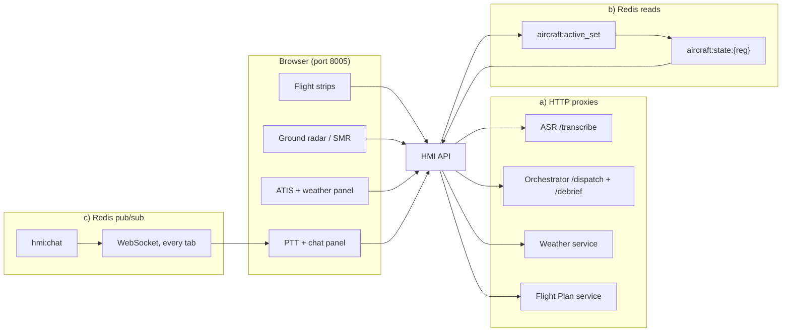
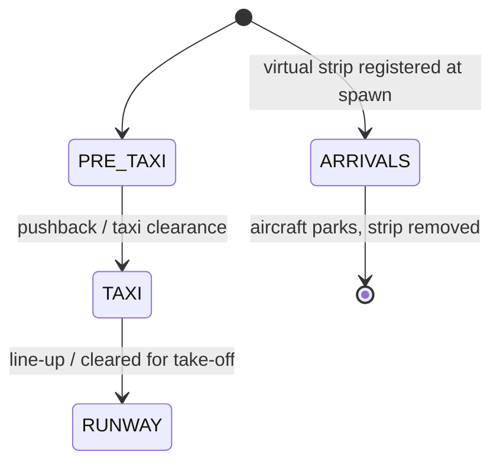

# Controller HMI Service

**Port 8005:8000** · [`services/controller_hmi_service/`](../../services/controller_hmi_service/) ·
the controller-facing web app and API gateway. Health: `/api/v1/hmi/health` · open at
[http://localhost:8005](http://localhost:8005). See [architecture](../architecture.md).

## What it does

The controller's screen, and the single host the browser ever talks to: every panel — flight
strips, ground radar, ATIS, push-to-talk chat — renders through this one gateway, which proxies
out to the backend services and reads Redis directly for whatever needs to feel live.

| Relations | Modules |
|---|---|
| **Called by** | the browser — every panel, plus login and session control (those routes live under `/api/v1/plugin/*`, despite the name) · the X-Plane plugin (`POST /airport` to report the ICAO it's running, `DELETE /strips/arrivals` to clear stale strips at session start) · [Arrival Simulator](arrival_simulator_service.md) (`POST /strips/arrival`, registers virtual strips) |
| **Calls** | [ASR](asr_service.md) (`/transcribe`) · [Orchestrator](orchestrator_service.md) (`/dispatch`, `/debrief/generate`) · [Weather](weather_service.md) · [Flight Plan](flight_plan_service.md) — all HTTP proxies · PostgreSQL `users` (auth) · Redis (live positions, session handshake, chat fan-out) |

## One host for the browser

A browser tab cannot be handed five different backend addresses and told to keep them straight —
so it isn't. It knows one origin, port 8005, and for the core comms loop nothing else. At startup
`main.py` reads `ASR_URL` and `ORCHESTRATOR_URL` from the environment and writes them into
`static/config.js` as `window.HMI_CONFIG`, so the same static bundle works unmodified whether
those services sit behind docker-compose names, Cloud Run URLs, or localhost.

Three distinct mechanisms sit behind that one origin. Strips, ATIS and PTT are request/response:
the browser calls an HMI endpoint, the HMI calls ASR, the orchestrator, weather or flight plan
over plain HTTP, and hands back the JSON. The ground radar is a read, not a request in the usual
sense — large parts of the UI are simply a view over Redis, and the radar is the clearest case: it
polls an HMI endpoint that reads `aircraft:active_set` for who's currently flying, then
`aircraft:state:{reg}` for each one's live latitude, longitude, heading and phase, once a second.
And the chat log is pushed, not polled: the HMI subscribes to the Redis pub/sub channel
`hmi:chat` and fans every message out over a WebSocket to every browser tab currently open, so a
taxi-clearance rejection spoken in the pilot's voice reaches every open controller position at
once.

## The controller's picture

Four columns make up the flight-strip board: **PRE_TAXI**, **TAXI**, **RUNWAY**, **ARRIVALS**. A
departure is born in PRE_TAXI and moves right as the controller works it — dragging a strip
between columns issues `PATCH /strips/{reg}/state`, which accepts either the HMI's own upper-case
phase codes (`PUSHBACK`, `TAXI`, `LINEUP`, `CLEARED`...) or the lower-case vocabulary the plugin's
mover uses for its own motion state machine (`taxi_out`, `landing_roll`, `vacating`...) and
normalizes both through one `column_map` — the two state machines described in
[architecture](../architecture.md) don't share a vocabulary, so this endpoint is where that gets
papered over. Arrivals skip PRE_TAXI and TAXI entirely: the moment the
[Arrival Simulator](arrival_simulator_service.md) spawns an aircraft on the ILS it registers a
**virtual strip** — a synthetic flight plan with no row in the flight-plan database — straight
into ARRIVALS, where it stays through approach, landing roll, vacating and taxi-in until the
aircraft parks and the strip is removed.

The ground radar (SMR) is drawn, not simulated. `GET /airport/graph` parses the airport's X-Plane
`.dat` file into nodes, edges, stands and runways — cached in memory per ICAO, downloaded
automatically the first time that airport is requested — and the browser projects the graph into
an SVG. Aircraft dots use real coordinates from `aircraft:state:{reg}` whenever a live position
exists; only a strip with no position yet falls back to an estimated slot inside its column. ATIS
and weather are plain proxies onto the [Weather service](weather_service.md), including on-demand
ATIS generation with controller-supplied runway and QFE overrides. The chat panel merges two
sources: the push-to-talk round trip below renders straight into the tab that triggered it, and
the `hmi:chat` fan-out described above adds pilot-voice taxi-clearance rejections from the taxi
router to every tab.

## Push-to-talk, step by step

1. The controller holds the PTT key — Spacebar by default, rebindable from the chat panel's gear
   icon or the ASR settings screen (both save to the same `airport_asr_settings` entry in
   `localStorage`).
2. `MediaRecorder` starts capturing the microphone the instant the key goes down.
3. Releasing the key stops the recorder and POSTs the clip to `/api/v1/hmi/asr/transcribe` — the
   HMI's own proxy, which forwards the raw multipart body to `ASR_URL/transcribe` server-side.
4. The corrected transcript comes back and is pushed into the chat log as the controller's line.
5. The same script immediately POSTs that transcript to `/api/v1/hmi/orchestrator/dispatch`; the
   reply that comes back is pushed into the chat log under the responding callsign — the pilot's
   readback.

See [architecture](../architecture.md) for the full voice-to-motion sequence, and
[ASR](asr_service.md) for why "transcribe" is really two steps — a Whisper pass and an LLM
callsign correction — hidden behind that one proxy call.

## Starting a session from the browser

Session control is not an HTTP call the plugin answers — it is a Redis hash the plugin polls, the
same pattern as everything else that crosses the Docker/X-Plane boundary. The HMI only ever asks;
the plugin does the work. That said, the routing is easy to misread from the file names alone: the
setup screens live under the URL prefix `/api/v1/plugin` and the file `api/plugin_routes.py`,
which reads like "the X-Plane plugin's API" — but every one of those endpoints (`/login`,
`/register`, `/session/start`, `/session/stop`, `/session/status`, the per-user API-key routes) is
called by the **browser's** setup screen, not by the plugin. The plugin's only two HTTP calls into
this service are `POST /airport`, to report the ICAO it just loaded, and `DELETE
/strips/arrivals`, to clear stale virtual strips at session start — a session can't even be
started from the browser until the plugin has reported an airport at least once.

Logging in checks the username/password hash in Postgres `users`; if that user has a stored key,
login also writes it into the `airport:asr_config` hash under `api_key`, the same hash the ASR
service is meant to read its runtime key from. The ASR backend and model choice, by contrast,
never leave the browser — they live only in `localStorage`. Starting a session writes one hash in
one shot: `type`, `weather`, `aircraft_count`, `complexity`, the current `icao`, `status:
"pending"` and an empty `session_id`, all `HSET` into `airport:session_request`. The plugin polls
that hash every two seconds ([xplane](../xplane.md) has the full lifecycle); seeing `pending` it
flips the status to `starting`, does the heavy lifting — loads the airport, generates flight
plans, spawns the fleet — and writes back `status: active` with a real `session_id`, or `status:
error` if any step failed. The setup screen polls `/session/status` every 1.5 s and jumps the
browser into the HMI proper the moment it reads `active`. Stopping mirrors this: the browser posts
`/session/stop`, which snapshots the outgoing `session_id` (so a debrief can still be requested)
and sets `status: stop_pending`; the plugin tears the session down and deletes the hash outright,
so the next status read reports `idle`.

## Auth and layout

Passwords are salted and hashed with PBKDF2-SHA256 (`api/auth.py`), never stored in the clear; the
`users` table carries one extra column, `openai_api_key`, for the per-user ASR key described
above.

| Path | Role |
|---|---|
| [`main.py`](../../services/controller_hmi_service/main.py) | FastAPI entrypoint; writes `static/config.js`, mounts the static app |
| [`api/routes.py`](../../services/controller_hmi_service/api/routes.py) | Strips, radar, weather/ATIS, ASR + orchestrator proxies |
| [`api/chat.py`](../../services/controller_hmi_service/api/chat.py) | `hmi:chat` WebSocket fan-out |
| [`api/plugin_routes.py`](../../services/controller_hmi_service/api/plugin_routes.py) | Auth, session handshake, per-user ASR key — browser-called, despite the name |
| [`api/auth.py`](../../services/controller_hmi_service/api/auth.py) | Postgres connection + password hashing |
| `static/` | Vite build output the browser actually receives — gitignored, generated, never edited by hand (see below) |

## Frontend: Vite + TypeScript (epic #59)

The UI used to be hand-written JS living straight under `static/js/`. As of epic #59 (PRs
#76-#89, merged into `dev`) it is a proper build: source lives in
[`frontend/`](../../services/controller_hmi_service/frontend/) and compiles into `static/`, which
`main.py` still serves via `StaticFiles(directory="static", html=True)` — the runtime contract at
the bottom of [architecture](../architecture.md) hasn't changed, only how that directory gets
built.

**History, briefly:** the original `static/*.html` files were never actually committed — an
unanchored `*.html` rule in `.gitignore` silently swallowed them from day one, and no copy
survived on disk. Phase 0 of the migration (`7706a5a`) reverse-engineered `index.html` and
`setup.html` from the 11 legacy JS files' DOM lookups and pinned the result with a regression
test (`test_dom_contract.py`, below) before any TypeScript conversion began.

### Source layout

`frontend/` is a Vite 6 + TypeScript 5 (`strict`, `noUncheckedIndexedAccess`) multi-page root —
two HTML entry points, one `src/` tree:

| Path | Role |
|---|---|
| [`index.html`](../../services/controller_hmi_service/frontend/index.html) | TWR workstation page; loads `src/main.ts` |
| [`setup.html`](../../services/controller_hmi_service/frontend/setup.html) | Login / register / session / ASR-settings page; loads `src/setup-main.ts` |
| [`src/main.ts`](../../services/controller_hmi_service/frontend/src/main.ts) | Composition root for `index.html`: imports CSS + legacy modules for their side-effect listener wiring, then calls `startUTCClock`, `initWindInstruments`, `initLightingControls`, `initSMRMap`, `startPolling` on `DOMContentLoaded` |
| [`src/setup-main.ts`](../../services/controller_hmi_service/frontend/src/setup-main.ts) | Composition root for `setup.html`: `legacy/radar`, `legacy/asr`, `legacy/setup` |
| [`src/legacy/`](../../services/controller_hmi_service/frontend/src/legacy/) | The 12 DOM-bound feature modules migrated from vanilla JS: `efs`, `weather`, `wind`, `atis`, `debrief`, `setup`, `asr`, `radar`, `resize`, `ptt`, `chat`, `header-widgets` — all strict TS, no IIFEs, no `window` bridges; each module wires its own `addEventListener` calls in an `init*()` function called from a composition root |
| [`src/smr/`](../../services/controller_hmi_service/frontend/src/smr/) | Ground-radar internals: `projection.ts` (pure geo→SVG math, Vitest-tested), `state.ts` (shared `smrState`: graph, bounds, viewBox, active ILS runway), `render.ts` (builds/updates the SVG), `interaction.ts` (pan/zoom/label-drag) |
| [`src/polling.ts`](../../services/controller_hmi_service/frontend/src/polling.ts) | The five refresh loops (strips 15 s, weather/TAF 60 s, airport 30 s, live positions 1 s) plus the app-level data they own (`flightPlans`, live positions, `currentICAO`) — the closest thing the app has to a store, see ADR-001 below |
| [`src/chat/ui.ts`](../../services/controller_hmi_service/frontend/src/chat/ui.ts), [`src/efs/format.ts`](../../services/controller_hmi_service/frontend/src/efs/format.ts) + [`ordering.ts`](../../services/controller_hmi_service/frontend/src/efs/ordering.ts), [`src/weather/taf.ts`](../../services/controller_hmi_service/frontend/src/weather/taf.ts), [`src/wind/calc.ts`](../../services/controller_hmi_service/frontend/src/wind/calc.ts) | Pure logic extracted out of the DOM-bound modules specifically so it can be unit-tested |
| [`src/api/client.ts`](../../services/controller_hmi_service/frontend/src/api/client.ts) | One typed fetch wrapper per backend endpoint (`getStrips`, `getAircraftPositions`, `dispatchOrchestrator`, `login`, `startSession`, ...) |
| [`src/types/api.ts`](../../services/controller_hmi_service/frontend/src/types/api.ts) | Typed mirror of the backend contract — kept in sync by hand against `api/routes.py`, `api/plugin_routes.py`, `api/chat.py` |
| [`src/lib/storage.ts`](../../services/controller_hmi_service/frontend/src/lib/storage.ts) | Typed accessors for every `localStorage` key (`airport_asr_settings`, `hmi-panel-sizes`, per-registration SMR label offsets and strip labels) |
| `src/lighting.ts`, `src/rimcas.ts`, `src/runway-sequence.ts` | Smaller standalone panels (lighting controls, runway-incursion alerting, the runway-sequence bar) pulled out of the old `app.js` god-file |

### Build output and `config.js`

`static/` is entirely generated — `npm run build` (or `npm run watch`) — and is gitignored;
nothing under it is hand-edited or committed. `main.py` still regenerates `static/config.js` at
every service start from `ASR_URL` / `ORCHESTRATOR_URL`, and that file stays **outside** the Vite
bundle graph by design: both HTML entries load it with a plain `<script src="/config.js">` before
the module script, so runtime env vars don't need a rebuild. `public/config.js` is a checked-in
dev fallback Vite copies verbatim for `npm run dev`.

### Dev workflows

`docker-compose.yml` bind-mounts `./static:/app/static`, which **shadows** whatever the Docker
image built — so the host `static/` must be produced separately before `docker compose up`:

| Workflow | Command | When |
|---|---|---|
| Build once | `cd frontend && npm ci && npm run build`, then `docker compose up -d` | Simplest, no live iteration |
| Watch + rebuild | `npm run watch` | Editing while the stack runs; reload the browser after each save |
| Vite dev server | `npm run dev` (port 5173, proxies `/api` to `:8005` with `ws: true` for the chat WebSocket) | Fastest loop, HMR for CSS |

Without the compose bind mount (e.g. Cloud Run), the multi-stage
[`Dockerfile`](../../services/controller_hmi_service/Dockerfile) is self-contained: a
`node:22-alpine` stage runs `npm ci && npm run build`, and the `python:3.11-slim` stage copies
`main.py`, `api/`, and the built `static/` from it.

### Testing

| Layer | What | Where |
|---|---|---|
| Vitest | 53 unit tests over the pure modules (`efs/format`, `efs/ordering`, `weather/taf`, `wind/calc`, `smr/projection`) | `npm test` (or `npm run test:watch`); config in [`vitest.config.ts`](../../services/controller_hmi_service/frontend/vitest.config.ts) |
| DOM contract | Pins the JS↔HTML contract so the Phase-0 loss can't repeat: every `getElementById`/`querySelector` id or class the TS looks up must resolve in `index.html`/`setup.html` (minus an explicit allowlist of runtime-created ids/classes), and inline `on*=` handlers are forbidden outright | [`tests/unit/controller_hmi/test_dom_contract.py`](../../tests/unit/controller_hmi/test_dom_contract.py) |
| CI | A dedicated `frontend` job (`.github/workflows/ci.yml`) runs `npm ci`, `typecheck`, `lint`, `test`, `build` on Node 22 for every push/PR touching `dev`/`main` | [`.github/workflows/ci.yml`](../../.github/workflows/ci.yml) |

### State: no Redux Toolkit, for now

The repo-wide rule mandates Redux Toolkit for global state, but there is no React here, and after
the Phase-3 module split `polling.ts` (server data) and `smr/state.ts` (SMR view state) already
centralize ownership behind typed functions at near-zero cost — hand-rolled RTK without React
would out-boilerplate the state surface it manages. The decision, and the concrete triggers that
would flip it (a React rewrite, shared *derived* state across more than two consumers, undo/redo
or cross-tab sync), are recorded in
[`frontend/docs/adr-001-no-global-state-library.md`](../../services/controller_hmi_service/frontend/docs/adr-001-no-global-state-library.md).

## Related
[architecture](../architecture.md) · [xplane](../xplane.md) · [asr](asr_service.md) · [orchestrator](orchestrator_service.md) · [index](../index.md)
