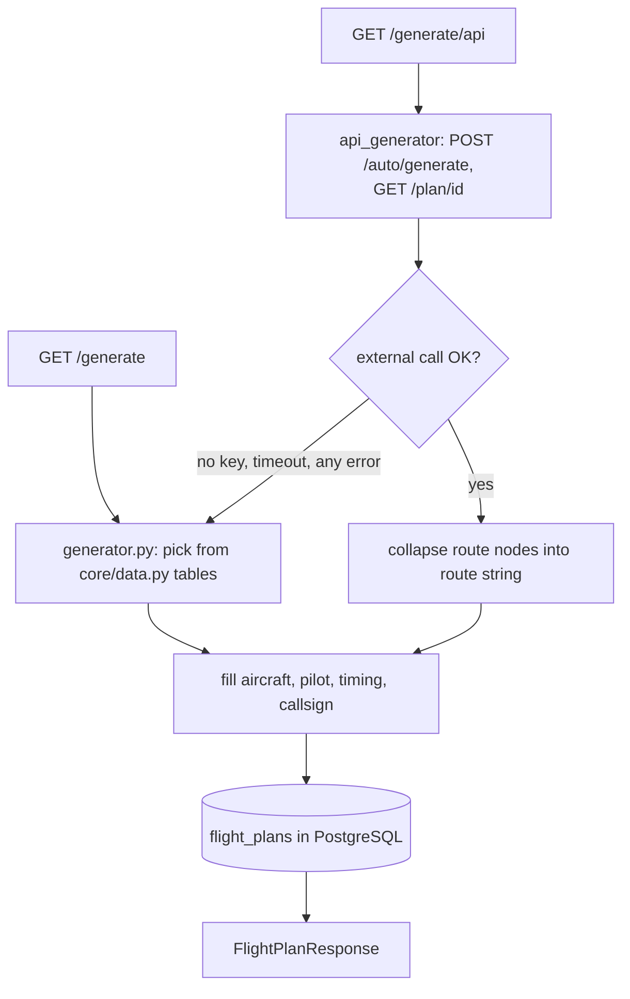

# Flight Plan Service

**Port 8003:8000** · [`services/flight_plan_service/`](../../services/flight_plan_service/) ·
generates and stores the IFR flight plans that give every aircraft its identity. Health:
`/api/v1/flight-plan/health`. Backed by PostgreSQL. See [architecture](../architecture.md).

## What it does

Generates and stores the IFR flight plans that give every aircraft its identity: registration,
callsign, aircraft type, route, cruise level. Every plan comes from one of two generators — a live
routing API or a fully local one — and callers can't tell which produced it from the response
shape; the service always answers with a complete plan and a `200`.

| Relations | Modules |
|---|---|
| **Called by** | [Controller HMI](controller_hmi_service.md) (`/strips` proxy) · [Arrival Simulator](arrival_simulator_service.md) (plan catalog) · [Orchestrator](orchestrator_service.md) (known-aircraft context) · X-Plane plugin (session-start fleet generation) |
| **Calls** | flightplandatabase.com (optional, `FLIGHT_PLAN_GENERATOR_KEY`) · PostgreSQL (`flight_plans`) |

**Try it standalone:** <http://localhost:8003/docs> · health `GET /api/v1/flight-plan/health`.

## How a plan is generated

Two GET endpoints under `/api/v1/flight-plan` produce a plan, and the difference between them is
the whole story. `/generate/api`
([`api/routes.py`](../../services/flight_plan_service/api/routes.py)) tries
[`core/api_generator.py`](../../services/flight_plan_service/core/api_generator.py) first: it
POSTs to flightplandatabase.com's `/auto/generate` with a departure (default `LEST`, overridable)
and one of four hard-coded destinations — `LEBL`, `LEMD`, `LEVC`, `LEAL` — picked at random if none
is given, then GETs `/plan/{id}` for the full waypoint list and collapses consecutive nodes on the
same airway into a single `entry AIRWAY exit` route string. It authenticates with
`FLIGHT_PLAN_GENERATOR_KEY` (blank by default in `.env.example`), sent as the HTTP basic-auth
username. `/generate` (no suffix) never touches the network: it calls
[`core/generator.py`](../../services/flight_plan_service/core/generator.py) directly, which draws
every field from the tables in [`core/data.py`](../../services/flight_plan_service/core/data.py) —
7 aircraft types, 10 airlines, and 12 Spanish airports with point-to-point distances — falling back
to `LEST` only if the requested departure isn't one of those 12, and choosing a destination from
any of the other 11, not just the API route's fixed four.

The fallback is what makes this resilient rather than merely "has an offline mode": the
`/generate/api` handler wraps the entire external call in a bare `except Exception`, so a missing
key, an expired session, a timeout, or a 500 from flightplandatabase.com all land in the same place
— a fresh call to the identical local generator `/generate` uses directly. Either path fills the
remaining fields — registration, callsign, PIC name, passenger count, cruise speed/altitude, EET,
endurance, alternates — the same way, in Python, from the same tables, and both persist through
`FlightPlanRepository.create()` into the `flight_plans` table
([`core/database/models.py`](../../services/flight_plan_service/core/database/models.py)) before
returning. Since that table predates the `callsign` column,
[`main.py`](../../services/flight_plan_service/main.py) runs a one-off ad-hoc migration at
startup — no Alembic — that adds the column via a raw `ALTER TABLE` if it's missing. In practice
the whole system runs keyless: the X-Plane plugin's own session-start call, the only place flight
plans get generated in bulk, uses `/generate` exclusively.

## Who consumes plans

Every AI aircraft's identity traces back to a row in `flight_plans`; the four consumers below just
read it in different shapes.

- The [Controller HMI](controller_hmi_service.md) — the controller's screen, and the single host
  the browser ever talks to — proxies `GET /plans` at its own `/strips` endpoint, merging the real
  rows with in-memory "virtual" arrival strips for aircraft the Arrival Simulator has dispatched
  but that don't have a DB plan yet.
- The [Arrival Simulator](arrival_simulator_service.md) — keeps AI arrivals coming down the ILS so
  the controller always has traffic — treats any plan whose `destination_ICAO` matches the session
  airport as an inbound
  ([`core/plan_catalog.py`](../../services/arrival_simulator_service/core/plan_catalog.py)),
  falling back to a built-in six-aircraft synthetic pool when the DB has none left or the service
  is unreachable.
- The [Orchestrator](orchestrator_service.md) — the routing brain — proxies
  `GET /plans/{registration}` (`api/flight_plans.py`) and folds the result into
  `get_known_aircraft()`'s three-source merge, tagged `source: "flight_plan"`, alongside
  PostgreSQL clearances and live Redis state.
- The X-Plane plugin
  ([`xplane_plugin/services/flight_plan_service.py`](../../xplane_plugin/services/flight_plan_service.py))
  doesn't just read plans, it seeds them: at session start,
  [`ui/windows_manager.py`](../../xplane_plugin/ui/windows_manager.py)'s
  `_execute_start_from_redis` clears every existing plan and generates a fresh batch — one per
  aircraft, departure forced to the session's airport — before handing them to `StandAssigner` to
  spawn the parked fleet at compatible gates.

## Layout

| Path | Role |
|---|---|
| [`main.py`](../../services/flight_plan_service/main.py) | FastAPI app; creates tables; ad-hoc `callsign` column migration |
| [`api/routes.py`](../../services/flight_plan_service/api/routes.py) | Health, `/generate` and `/generate/api` routers, plans CRUD, reference data |
| [`core/api_generator.py`](../../services/flight_plan_service/core/api_generator.py) | flightplandatabase.com client: route generation, node collapsing |
| [`core/generator.py`](../../services/flight_plan_service/core/generator.py) | Fully offline local generator |
| [`core/data.py`](../../services/flight_plan_service/core/data.py) | Static tables: aircraft, airports, distances, airlines, pilot names |
| [`core/database/`](../../services/flight_plan_service/core/database/) | `connection.py` (engine/session), `models.py` (`FlightPlanModel`), `repositories/flight_plan.py` (CRUD) |
| [`models/schemas.py`](../../services/flight_plan_service/models/schemas.py) | Pydantic `FlightPlanResponse` / `HealthResponse` |

## Related
[architecture](../architecture.md) · [controller_hmi](controller_hmi_service.md) · [arrival_simulator](arrival_simulator_service.md) · [orchestrator](orchestrator_service.md) · [index](../index.md)
