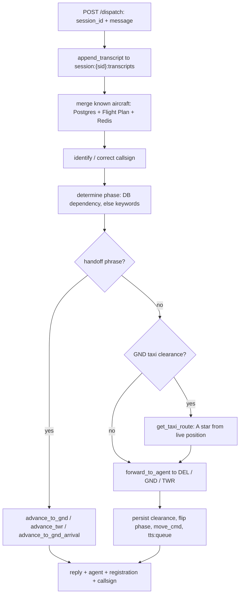
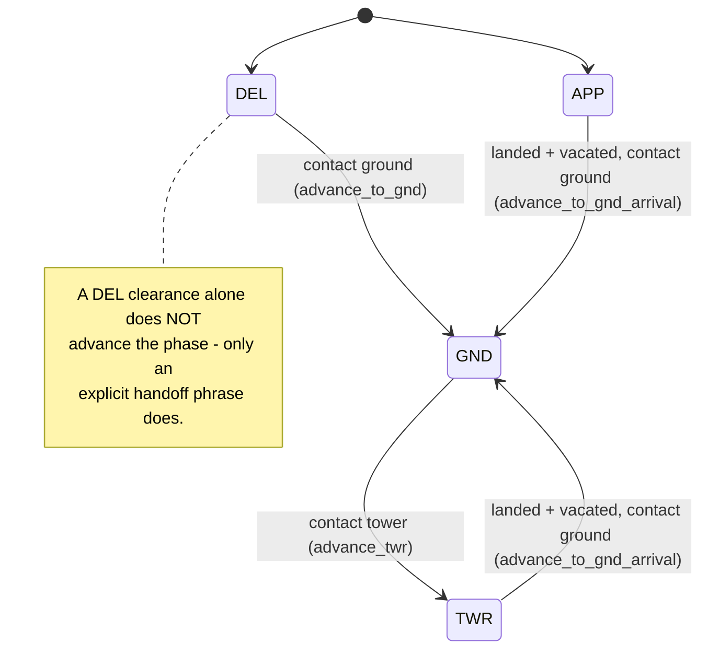
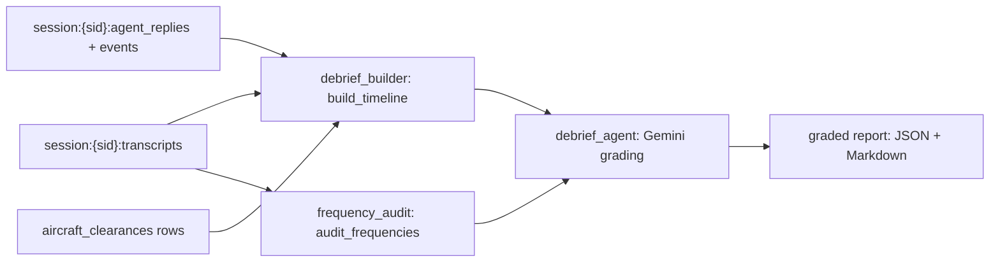

# Orchestrator Service

**Port 8007:8006** · [`services/orchestrator_service/`](../../services/orchestrator_service/) ·
the only service that decides which aircraft, which controller phase, and which pilot agent a
transmission belongs to. See [architecture](../architecture.md).

## What it does

The orchestrator is the routing brain — decides which aircraft, which controller phase, which
pilot agent, and turns the reply into state and motion. Every controller transmission that has
already been transcribed passes through here before anything answers back or moves; nothing else
in the stack gets to make that call.

| Relations | Modules |
|---|---|
| **Called by** | [Controller HMI](controller_hmi_service.md) proxy (`POST /dispatch`) · [Arrival Simulator](arrival_simulator_service.md) (`POST /arrivals/register`) |
| **Calls** | [Flight Plan](flight_plan_service.md) · [Weather](weather_service.md) · DEL / GND / TWR [pilot agents](../agents.md) on Cloud Run · PostgreSQL · Redis |

**Try it standalone:** <http://localhost:8007/docs> · health `GET /health` — host port is
**8007**, the container listens on **8006**
([why](../guides/configuration.md#host-vs-container-ports)).

## What happens on /dispatch

[`api/dispatch.py`](../../services/orchestrator_service/api/dispatch.py) receives
`{session_id, message}`, sent either by the [Controller HMI](controller_hmi_service.md) — the
controller's screen, and the single host the browser ever talks to — proxying the browser's
request, or directly by the [ASR service](asr_service.md), which turns controller speech into
corrected ATC text, when it's configured for server-side dispatch (`ORCHESTRATOR_URL`). Before
anything else can go wrong, the endpoint appends that exact text to
`session:{sid}:transcripts` in Redis: whatever happens next — a Cloud Run agent timing out,
Postgres refusing a write — the debrief will still have the controller's real words.

Only then does it hand off to [`runner.py`](../../services/orchestrator_service/runner.py),
which runs the routing agent in a thread-pool executor (`runner.py` opens its own event loop
with `asyncio.run`, and a FastAPI request handler is already inside one, so it can't run there
directly). The agent itself is a Google ADK `Agent` on Gemini (`AGENT_MODEL`, resolved to
`gemini-3.1-flash-lite` in this stack) driven by a fixed workflow written into its system prompt
([`agent/prompts.py`](../../services/orchestrator_service/agent/prompts.py)):

It first calls `get_known_aircraft()`, which returns a list `runner._fetch_known_aircraft()`
pre-fetched before the agent ever starts, merged from three sources: PostgreSQL
`aircraft_clearances` (authoritative — it carries the current phase), the Flight Plan service's
`GET /plans` (aircraft filed but not yet cleared), and Redis `aircraft:active_set` plus
`aircraft:state:{reg}` (aircraft alive in the sim right now). Against that merged list the agent
identifies and corrects the callsign the controller used.

Next it resolves the phase. If the aircraft is already known, the DB's `dependency` column wins
outright. If not, the prompt falls back to keyword inference: "delivery / clearance / IFR /
squawk" → DEL, "taxi / pushback / ground" → GND, "ready / lineup / tower / takeoff" → TWR, DEL if
nothing matches. Before routing anywhere, it checks the message for a handoff phrase — "contact
ground on 121.9", "contact tower on 118.1" — which short-circuits everything else: the matching
tool fires and its readback is returned directly, without a pilot agent ever seeing the message
(next section).

Otherwise, if the destination is GND and the message reads as a taxi clearance, the agent calls
`get_taxi_route()` first: an A\* search over the airport's taxiway graph, seeded from the
aircraft's live position in `aircraft:state:{reg}`. Finally `forward_to_agent()` POSTs the
message — plus DEL flight-plan/ATIS context, or the GND/TWR clearance record with the taxi route
merged in — to the phase's Cloud Run agent, one of the stateless Gemini pilots that draft the
ICAO readback — nothing more. Inside that same tool call the reply is logged to
`session:{sid}:agent_replies`, and — if the pilot just acknowledged a pushback or a taxi
clearance — handed to the shared taxi router's `dispatch_taxi_plan()` (see [shared](../shared.md)),
which writes the movement plan to `aircraft:{reg}:move_cmd`.

Once the agent run completes, `runner.py` does the bookkeeping no LLM is trusted with: it upserts
the DEL clearance fields into `aircraft_clearances` if one was issued — this alone does **not**
move the phase, see below — and flips `dependency` to GND, TWR, or GND again if one of the
handoff tools set its flag. Back in `dispatch.py`, the reply is RPUSHed onto `tts:queue`, and the
endpoint returns `{reply, agent, aircraft_registration, callsign}`.

## The controller-phase state machine

The phase an aircraft is in — APP, DEL, GND, or TWR — lives in exactly one place: the PostgreSQL
column `aircraft_clearances.dependency`. It isn't cached or mirrored anywhere else; the
orchestrator owns it outright, and it answers one question — which controller position owns this
aircraft right now?

Two rules keep it honest. Only three tools ever move it — `advance_to_gnd`, `advance_to_twr`,
`advance_to_gnd_arrival` — and each fires strictly on an explicit handoff phrase read from the
transcript. And, easy to miss: **issuing a DEL clearance does not advance the phase.**
`runner.py` persists the clearance fields the moment DEL replies, but the aircraft stays in DEL
until the controller actually says "contact ground on {freq}" — a deliberate split between
*cleared* and *released*.

A departure walks DEL → GND → TWR. An arrival is registered by the Arrival Simulator straight
into APP (`POST /arrivals/register`), skipping DEL and GND, and only re-enters GND once TWR has
cleared it to land and the pilot has vacated — the reverse handoff `advance_to_gnd_arrival`
exists because that transition can start from either APP or TWR.

This is a different bookkeeping problem from the **motion state machine** the X-Plane plugin's
mover keeps for the same aircraft (`waiting → pushback → taxi_out → done`, or the arrival
equivalent) — see [xplane](../xplane.md). A controller handoff never moves the aircraft, and a
completed taxi never changes who owns the frequency; the two machines only meet through the taxi
router.

## The routing agent's tools

`orch_agent` ([`agent/agent.py`](../../services/orchestrator_service/agent/agent.py)) is a
single Google ADK `Agent` wired to six tools; the system prompt is the actual workflow — the
tools below are just what it's allowed to touch.

| Tool | File | Purpose |
|---|---|---|
| `get_known_aircraft` | [`tools/aircraft.py`](../../services/orchestrator_service/agent/tools/aircraft.py) | Returns the merged aircraft list already sitting in session state |
| `get_taxi_route` | [`tools/taxi_route.py`](../../services/orchestrator_service/agent/tools/taxi_route.py) | Extracts destination + via-taxiways from the raw instruction, runs the A\* search |
| `advance_to_gnd` | [`tools/advance_to_gnd.py`](../../services/orchestrator_service/agent/tools/advance_to_gnd.py) | DEL → GND on a ground-frequency handoff |
| `advance_to_twr` | [`tools/advance_twr.py`](../../services/orchestrator_service/agent/tools/advance_twr.py) | GND → TWR on a tower-frequency handoff |
| `advance_to_gnd_arrival` | [`tools/advance_to_gnd_arrival.py`](../../services/orchestrator_service/agent/tools/advance_to_gnd_arrival.py) | APP/TWR → GND, the post-landing reverse handoff |
| `forward_to_agent` | [`tools/forward.py`](../../services/orchestrator_service/agent/tools/forward.py) | POSTs to the phase's Cloud Run agent; logs the reply and triggers the taxi dispatch |

## Listening to the sim

A background asyncio task, started in the FastAPI `lifespan`
([`main.py`](../../services/orchestrator_service/main.py)) and stopped cleanly on shutdown, keeps
a second channel open to Redis — the boundary between the Docker backend and the host-side sim
plugin — that has nothing to do with `/dispatch`.
[`api/events_subscriber.py`](../../services/orchestrator_service/api/events_subscriber.py)
psubscribes to `aircraft:*:move_events` and subscribes to `hmi:chat`, and appends every message it
receives to `session:{sid}:events`, tagged with whatever session is currently active according to
`airport:session_request`. If the connection drops it retries every 2 seconds, indefinitely.

Why bother: the pilot agents only know what they said. The plugin's mover knows what actually
happened — whether an aircraft really reached its holding point, whether a taxi command got
rejected server-side. Without this subscriber the debrief would only ever have the LLM's side of
the story; with it, the session log also carries the sim's ground truth.

## The debrief

`POST /debrief/generate` ([`api/debrief.py`](../../services/orchestrator_service/api/debrief.py))
is where all three Redis session logs and the Postgres clearance rows for a session come back
together. [`debrief_builder.py`](../../services/orchestrator_service/debrief_builder.py)'s
`build_timeline()` interleaves `session:{sid}:transcripts`, `:agent_replies`, `:events`, and the
clearance rows into one chronological text block — pure functions, no I/O, easy to unit-test in
isolation. In parallel,
[`frequency_audit.py`](../../services/orchestrator_service/frequency_audit.py)'s
`audit_frequencies()` re-scans just the transcripts for every frequency the controller read out
(numeric or spelled out, English or Spanish), infers which service it was meant for from the
surrounding words, and compares it against the airport's real COM frequencies — a deterministic
check that catches wrong-controller mistakes an LLM grader might gloss over.

Both outputs feed
[`agent/debrief_agent.py`](../../services/orchestrator_service/agent/debrief_agent.py), which is
deliberately not an ADK agent: a debrief is one structured-JSON request with no tools and no
memory, so it calls the `google-genai` SDK against Vertex AI directly, asking for a
JSON-schema-constrained score (overall score, per-category scores, strengths, improvements, an
instructor summary). `render_markdown()` turns that JSON into the
Markdown the HMI shows in the debrief modal, with the frequency-audit table spliced in above the
categories.

## API surface

| Router | Prefix | Exposes |
|---|---|---|
| [`dispatch.py`](../../services/orchestrator_service/api/dispatch.py) | `/dispatch` | The main entry point — routes a transcript to a pilot agent (above) |
| [`arrivals.py`](../../services/orchestrator_service/api/arrivals.py) | `/api/v1/orchestrator/arrivals` | Registers an inbound aircraft into APP |
| [`debrief.py`](../../services/orchestrator_service/api/debrief.py) | `/debrief` | Builds and grades the end-of-session debrief |
| [`aircraft.py`](../../services/orchestrator_service/api/aircraft.py) | `/aircraft` | Position (Redis), clearance/taxi-route (Postgres), airport graph |
| [`clearances.py`](../../services/orchestrator_service/api/clearances.py) | `/clearances` | Direct clearance CRUD — mostly a test/seeding surface |
| [`flight_plans.py`](../../services/orchestrator_service/api/flight_plans.py) | `/flight-plans` | Proxy to the [Flight Plan](flight_plan_service.md) service |
| [`weather.py`](../../services/orchestrator_service/api/weather.py) | `/atis` | Proxy to the [Weather](weather_service.md) service |
| [`events_subscriber.py`](../../services/orchestrator_service/api/events_subscriber.py) | — | No HTTP surface — the background sim listener (above) |

## Data, support, tests

[`db/`](../../services/orchestrator_service/db/) is a small SQLAlchemy trio:
[`connection.py`](../../services/orchestrator_service/db/connection.py) (engine, session,
`init_db()`), [`models.py`](../../services/orchestrator_service/db/models.py) — a single table,
`AircraftClearance` → `aircraft_clearances` — and
[`repository.py`](../../services/orchestrator_service/db/repository.py)'s
`ClearanceRepository` (`upsert`, `get`, `update_dependency`). That table is the entire durable
memory of a departure: the DEL clearance fields (`squawk`, `instrumental_departure` — the SID,
`runway_in_use`, `altimeter`, `destination_icao`, free-text `clearance_text`), a JSONB
`taxi_route` column the GND agent fills in later, and `dependency` itself, defaulting to `DEL`.

Two more modules exist purely to feed the debrief:
[`session_log.py`](../../services/orchestrator_service/session_log.py) (the Redis list wrapper
behind the three `session:{sid}:*` keys) and
[`shared/callbacks.py`](../../services/orchestrator_service/shared/callbacks.py) (ADK
`before_agent_callback` / `after_agent_callback` — structured logging of what the agent saw and
decided, no state mutation).

[`tests/unit/orchestrator/`](../../tests/unit/orchestrator/) is the deepest unit suite in the
repo: eleven files covering the dispatch and arrivals endpoints, every advance tool, the forward
tool's Cloud Run call and taxi-dispatch trigger, `get_known_aircraft` and `get_taxi_route`, the
events subscriber, the repository, the runner's post-agent persistence logic, the frequency
audit, and the session log — a reflection of how much of the orchestrator's correctness lives in
deterministic Python around the LLM call, not in the call itself.

## Related
[architecture](../architecture.md) · [agents](../agents.md) · [shared](../shared.md) · [asr](asr_service.md) · [index](../index.md)
