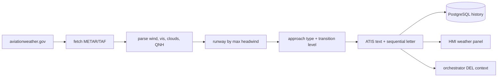

# Weather Service

**Port 8004:8000** · [`services/weather_service/`](../../services/weather_service/) ·
real METAR/TAF in, the session's ATIS out. Health: `/api/v1/weather/health`. See
[architecture](../architecture.md).

## What it does

Fetches real METAR/TAF and generates the ATIS the whole session keys off: every other component
that needs current conditions — or the runway in use — asks this service, not
aviationweather.gov directly.

| Relations | Modules |
|---|---|
| **Called by** | [Controller HMI](controller_hmi_service.md) (ATIS/weather panel, proxied) · [Orchestrator](orchestrator_service.md) (weather context fetched before forwarding to the DEL agent) |
| **Calls** | aviationweather.gov (external, METAR/TAF) · PostgreSQL (ATIS history) |

**Try it standalone:** <http://localhost:8004/docs> · health `GET /api/v1/weather/health`.

## From METAR to ATIS

Two thin layers sit around one real upstream API. `core/metar_taf_fetcher.py` is a small,
key-less **async** client — one shared `httpx.AsyncClient` with a 10 s timeout, closed by the
FastAPI lifespan — that hits `/api/data/metar` and `/api/data/taf` on aviationweather.gov;
`api/routes.py` exposes both as pass-through endpoints (`/metar/{icao}`, `/metar/{icao}/raw`,
`/taf/{icao}`, `/taf/{icao}/raw`) that reshape the JSON — or hand back the raw string — without
ever touching the database.

Upstream failures are typed, not swallowed: the fetcher raises `WeatherUpstreamError`
(carrying the status the API should answer with — 502 for an unreachable host, a bad status or an
undecodable body; 504 for a timeout) and `NoWeatherDataError` when the upstream is healthy but has
no observation for that airport. `routes.py` maps them to 502/504/404 respectively, and turns a
payload it cannot parse into a 502 rather than a 500 — an outage upstream is never reported as a
bug here.

The real work happens one layer up, in `core/atis_generator.py`. `ATISGenerator.generate()`
fetches the current METAR for the requested ICAO and parses wind direction/speed/gust,
visibility, cloud layers and QNH out of the raw fields (parsing that used to live in a separate
helper module; now it's inline here, and duplicated — lightly — in `routes.py`'s own `/metar`
handler). From wind alone it picks the runway: `_select_runway_from_wind` scores every runway
heading against the wind and keeps whichever is closest to a pure headwind. Once a runway is
chosen it picks an approach type — ILS first, then VOR, then RNAV — from a small hard-coded
`AIRPORT_DATA` table covering eleven Spanish airports (LEST, LEBL, LEMD, LECO, LEVX, LEGE, LEPA,
LEVC, LEAL, LEZL, LEMG); anything else falls back to a generic two-runway default. QNH drives a
five-step lookup for transition level — FL65 when pressure is high, stepping up to FL90 as QNH
drops below 978 hPa — and an in-memory counter per ICAO hands out a sequential ATIS letter with
its phonetic name ("information ALFA"), wrapping back to A after Z. ATC can override the
auto-picked runway, approach, QFE and remarks through query params on `GET /atis/{icao}` — they are
grouped in the `ATISOptions` model
([`models/schemas.py`](../../services/weather_service/models/schemas.py)) and bound with
`Depends(ATISOptions.as_query)`, so the query string itself is unchanged; a
`preview=true` flag runs the same generation without saving to PostgreSQL or advancing the letter —
the HMI's own `/atis/generate` proxy exposes that same flag to the ATC-facing form.

Every non-preview call persists through `ATISRepository` into the `atis_broadcasts` table;
`/atis/{icao}/latest` and `/atis/{icao}/history` read it back. That's the only weather data this
service stores — raw METAR and TAF are fetched fresh on every call and never written to the
database.

## Why it matters in a session

The quiet load-bearing output here isn't the METAR, it's the runway. Because
`_select_runway_from_wind` runs before anything else in `generate()`, whichever runway wins the
headwind score becomes the `arrival_runway`/`departure_runway` baked into that ATIS broadcast, and
everything downstream reads it off the text instead of recomputing it: the DEL agent's clearance
readback names that runway, the ATIS the HMI panel and pilot agents quote is the same one, and it
holds until ATC overrides it or a fresh letter is generated. Get the runway decision wrong and the
whole session's clearances point at the wrong end of the airport.

One honest caveat: this decision doesn't reach every corner of the sim. The
[Arrival Simulator](arrival_simulator_service.md) is currently hard-coded to LEST runway 17
geometry — spawn point, ~166° heading, the E3 vacate exit — regardless of which runway the ATIS
actually selected from the wind. Only the controller-facing clearance text follows the weather;
the simulated arrival traffic itself does not.

## Layout

| Path | Role |
|---|---|
| [`main.py`](../../services/weather_service/main.py) | FastAPI entrypoint; creates DB tables on startup |
| [`api/routes.py`](../../services/weather_service/api/routes.py) | Health, ATIS, METAR, TAF endpoints |
| [`core/metar_taf_fetcher.py`](../../services/weather_service/core/metar_taf_fetcher.py) | Thin client over aviationweather.gov (`/api/data/metar`, `/api/data/taf`) |
| [`core/atis_generator.py`](../../services/weather_service/core/atis_generator.py) | Parses METAR, picks runway/approach/transition level, builds ATIS text |
| [`core/database/models.py`](../../services/weather_service/core/database/models.py) | `ATISModel` → `atis_broadcasts` table |
| [`core/database/repositories/atis.py`](../../services/weather_service/core/database/repositories/atis.py) | ATIS CRUD (`create`, `get_latest_by_icao`, `get_all_by_icao`, ...) |
| [`core/database/connection.py`](../../services/weather_service/core/database/connection.py) | SQLAlchemy engine/session; `check_connection` backs the health check |
| [`models/schemas.py`](../../services/weather_service/models/schemas.py) | Pydantic request/response schemas |

## Related
[architecture](../architecture.md) · [controller_hmi](controller_hmi_service.md) · [orchestrator](orchestrator_service.md) · [arrival_simulator](arrival_simulator_service.md) · [index](../index.md)
