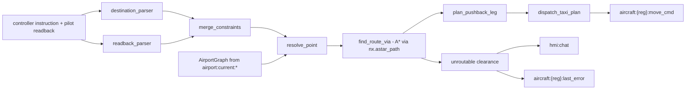

# Shared package (`shared/`)

Not a service — no port; imported as a package by the backend services and the X-Plane plugin.
Source under [`shared/`](../shared/).

## What it does

`shared/` is the backend's common library — models, geo, state stores, and the A\* taxi router.
Every service that needs to route an aircraft on the ground or persist its state draws from this
one package instead of re-implementing it.

| Consumed by | For |
|---|---|
| [Orchestrator](services/orchestrator_service.md) | the taxi router (`dispatch_taxi_plan`, `compute_taxi_route`), state reads |
| [Arrival Simulator](services/arrival_simulator_service.md) | `geo.py`, and writing the same `move_cmd` contract the taxi router writes |
| [Controller HMI](services/controller_hmi_service.md) | indirectly — reads what `shared/` writes to Redis (`hmi:chat`, `aircraft:state:{reg}`), no direct import |
| [X-Plane plugin](xplane.md) | `AircraftStateStore`, `AirportDataStore`, `StandAssigner`, `AircraftTracker` |

## From readback to route: the taxi router

The design point behind every module in
[`shared/services/taxi_router/`](../shared/services/taxi_router/): **the LLM never parses
taxiways — deterministic parsers do.** The GND pilot agent's only job is producing and
acknowledging ICAO phraseology; every taxiway letter, holding point, and pushback heading that
reaches a `move_cmd` is extracted, merged, and routed by plain Python, unit-tested under
[`tests/taxi_router/`](../tests/taxi_router/). A hallucinated waypoint can't move an aircraft —
the LLM never gets a chance to name one.

One controller instruction and one pilot readback go in:

- [`destination_parser.extract_destination`](../shared/services/taxi_router/destination_parser.py)
  reads the **controller's** words for where the taxi ends — holding point, runway, or stand —
  trying the most specific pattern first ("holding short of runway 17L" before the generic
  "runway 17" fallback). It never looks at the pilot's readback or the database's
  `runway_in_use`; if the controller named no endpoint, the last via-point becomes the
  destination.
- [`readback_parser`](../shared/services/taxi_router/readback_parser.py) reads the **pilot's**
  readback: `extract_taxiway_tokens` collapses phonetic spelling ("bravo", "golf one zero") into
  codes (`B`, `G10`); `parse_pushback_direction` turns "face north" or "face 090" into a heading.
- [`merge_constraints`](../shared/services/taxi_router/constraints.py) reconciles both lists —
  the pilot's order wins (ICAO requires reading the clearance back), but any taxiway the
  controller named that the readback dropped is spliced back in at the position that keeps
  progression monotonic. Nothing the controller instructed is allowed to silently vanish from the
  route.
- `router.py` loads the airport graph straight from Redis — `AirportDataStore().load()` reads
  `airport:current:*` — into [`plugins/GND/graph.py`](../plugins/GND/graph.py)'s `AirportGraph`,
  a `networkx.DiGraph` weighted by Haversine distance. `resolve_point` turns a spoken token into a
  graph node: runway designator, taxiway letter, or stand id, in that order.
- `find_route_from_position` snaps the aircraft's live GPS position (read from
  `aircraft:state:{reg}`) to the nearest node in the graph; `find_route_via` then forces the path
  through every merged via-point in order, stitching each leg with `nx.astar_path`. The same
  Haversine edge weights double as an admissible heuristic, so A\* returns the same optimal path
  Dijkstra would while exploring less of the graph.
- `plan_pushback_leg` computes the reverse-and-pivot geometry off the stand: a back-step distance
  clamped between `PUSHBACK_MIN_DIST_M`/`PUSHBACK_MAX_DIST_M`, the final heading the aircraft will
  face, and a pivot rate — the mover executes this as reverse-then-pivot before joining the taxi
  waypoints.
- `dispatch_taxi_plan` assembles whatever legs the clearance actually contains — pushback only,
  waypoints only, or both — into one versioned plan and writes `aircraft:{reg}:move_cmd` as JSON
  with a TTL sized to the plan's own ETA. When `find_route_via` can't connect the via-points,
  there is no `move_cmd`. `_shorten_reason` turns the graph's internal error into a short
  pilot-facing phrase instead ("taxiway B not found", "no route available", "position off the
  movement area"), and the router publishes it as a pilot-voice rejection — to `hmi:chat` for the
  transcript, to `tts:queue` so it is actually spoken, and to `aircraft:{reg}:last_error` (TTL 5
  min) for whoever is debugging.

## dispatch_taxi_plan: the handover

A `move_cmd` payload is a small envelope regardless of who wrote it: `version`, `plan_id`,
`started_at`, `delay_before_start_s`, and a `legs` list, each leg naming its own `mode`. The taxi
router emits `pushback` and `waypoints` legs (with a taxiway sequence and `speed_kts`); the
[Arrival Simulator](services/arrival_simulator_service.md) writes the same envelope shape with
`approach`, `landing_roll`, and `vacate` legs instead. The plugin's `AircraftMover` reads
`aircraft:{reg}:move_cmd` and drives whichever legs it finds by branching on `mode` — it doesn't
know or care whether the taxi router or the arrival simulator produced the plan, only that the
shape matches. For taxi clearances specifically, `shared/` owns the writer side: `dispatch_taxi_plan`
is the only thing that puts a `move_cmd` there. The return direction — motion milestones on
`aircraft:{reg}:move_events` — is published by the plugin mover on the other side of the
boundary; nothing in `shared/` writes or reads that channel (`config.py` defines the key template
alongside `move_cmd`'s, but only `move_cmd` is ever set from here). Execution detail — the
pushback → taxi state machine, the phase strings — lives on [xplane](xplane.md); the full key
contract is on [architecture](architecture.md#the-redis-contract).

## State in two tempos: aircraft_state_store

[`AircraftStateStore.update()`](../shared/services/aircraft_state_store.py) writes the same
[`AircraftState`](../shared/models/aircraft_state.py) snapshot twice, on purpose, in one
pipelined Redis call. For *now*: a hash at `aircraft:state:{reg}` (TTL 1 hour), the registration
added to `aircraft:active_set`, and the dict PUBLISHed on `aircraft:updates` — this is what the
HMI's ground radar and the taxi router's own position lookup read. For *history*: the same
snapshot becomes an InfluxDB point (`to_influx_point()`, measurement `aircraft_state`, tagged by
`session_id`/`registration`), buffered in memory and flushed every 20 points instead of written
one at a time (and force-flushed when `AircraftTracker.stop()` ends the session).
`query_replay(session_id)` reads InfluxDB back — filtered by session and optionally by
registration — for the post-session debrief. Why both stores exist alongside PostgreSQL is on
[architecture](architecture.md#three-data-stores-three-jobs).

## The rest of the toolbox

| Module | Role |
|---|---|
| [`airport_data_store.py`](../shared/services/airport_data_store.py) | The parsed airport graph (nodes/edges/stands/runways) + stand occupancy + `session:current`, all under Redis `airport:current:*` |
| [`stand_assigner.py`](../shared/services/stand_assigner.py) | Matches each flight plan to a free, compatible stand at session start — checks ICAO width code and props/jets vs. gate-only airline traffic |
| [`geo.py`](../shared/services/geo.py) | Pure geodesy, no dependencies: `haversine`, `bearing`, `advance`, `project_on_localizer`. Imported directly by the plugin's mover and by the arrival simulator; the taxi router keeps its own small `haversine`/`advance` duplicates in `router.py`/`pushback.py` rather than importing it |
| [`aircraft_tracker.py`](../shared/services/aircraft_tracker.py) | In-sim 2 Hz dataref reader feeding `AircraftStateStore`; imports `XPPython3` directly, so it only runs inside X-Plane |
| [`models/aircraft_state.py`](../shared/models/aircraft_state.py) | The `AircraftState` dataclass — `to_dict()` for the Redis hash, `to_influx_point()` for history |
| [`models/phases.py`](../shared/models/phases.py) | The **motion** phase enum — `parked`, `pushback`, `taxi_out`, `approach`, `landing_roll`, `vacating`, and the rest of what `AircraftMover` and `AircraftStateStore` emit. This is *not* the controller-phase state machine (`APP`/`DEL`/`GND`/`TWR`, owned by the orchestrator in PostgreSQL) — see [architecture](architecture.md#two-state-machines-not-one) for the distinction |

## One graph, two consumers

There is exactly one `AirportGraph` class:
[`plugins/GND/graph.py`](../plugins/GND/graph.py), a `networkx.DiGraph` built from parsed apt.dat
data — nodes, edges, stands, runway thresholds — with lookup indices for taxiway letters, stand
ids, and node names. It lives under the in-sim plugin tree, since apt.dat parsing only happens on
the host where X-Plane's scenery files are, but the backend doesn't keep its own copy. `router.py`'s
`_load_graph()` inserts `plugins/GND` onto `sys.path` — the module "is not a package", per the
code's own comment — and imports `graph` directly, then builds `AirportGraph(data=...)` from
whatever `AirportDataStore.load()` returned. Same class, two callers: the in-sim/dev tooling that
produced the JSON in the first place, and the backend taxi router that resolves and routes over
it. The apt.dat parsing story itself — row codes, active-zone filtering — lives on
[xplane](xplane.md).

## Tests

[`tests/taxi_router/`](../tests/taxi_router/) runs against real airport data — LEBL's parsed
graph, committed as a fixture and regenerated via `python -m plugins.GND.data_parser LEBL`. It is
split into `graph_construction/` (building `AirportGraph` from a JSON file or a dict),
`token_resolution/` (`resolve_point`, `extract_destination`, `extract_taxiway_tokens`,
`merge_constraints`), and `taxi_routing/` (end-to-end routing and the pushback leg), plus a
root-level `test_hmi_chat.py` for the rejection path.

## Related
[architecture](architecture.md) · [xplane](xplane.md) · [orchestrator](services/orchestrator_service.md) · [arrival simulator](services/arrival_simulator_service.md) · [index](index.md)
