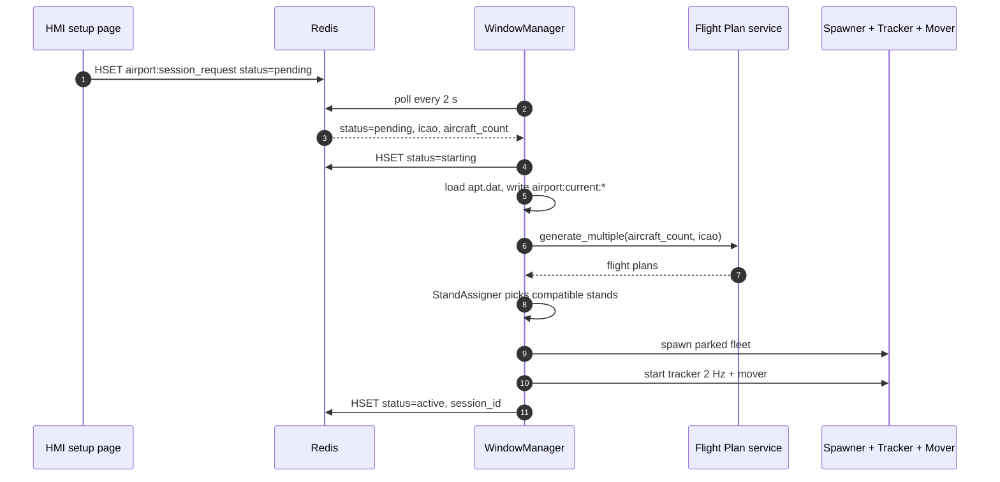
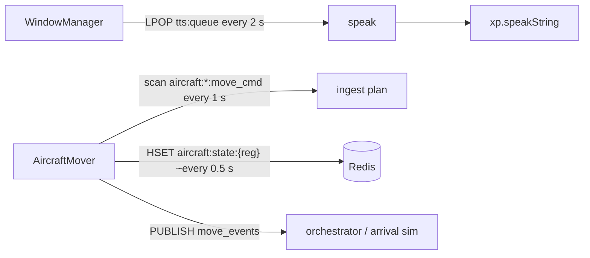
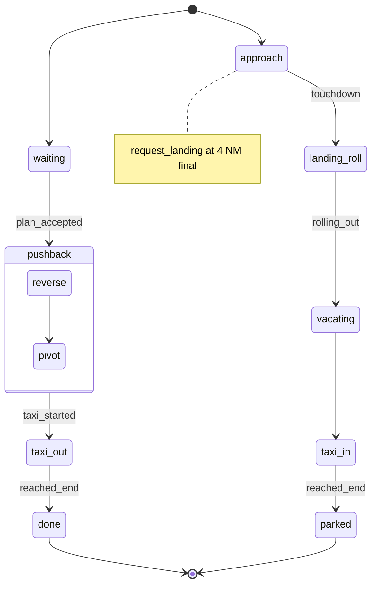

# X-Plane integration

Two source trees, one job: put the controller's clearances into motion and give every parked or
airborne aircraft a voice. The development tree is [`xplane_plugin/`](../xplane_plugin/); what you
actually copy into X-Plane is [`plugins/`](../plugins/). See [architecture](architecture.md) for
where this sits in the voice → motion pipeline, and
[X-Plane Plugin Setup](guides/xplane-plugin-setup.md) to install it.

## What it does

**Everything inside the simulator: spawn, move, speak.** The plugin is the only part of AIrport
that runs inside X-Plane 12's own process, on the host, never inside Docker — and that shapes how
it talks to everything else. It exposes no port and answers no HTTP request; it is a Redis
**client**, not a server. Every command it obeys arrives as a key it reads; everything it reports
leaves as a key it writes or an event it publishes. There is no dedicated TTS microservice to route
speech through — `services/tts_service/` is an empty placeholder — every line a pilot speaks in an
AIrport session is synthesized right here.

| Relations | Redis keys |
|---|---|
| **Consumes** | `aircraft:{reg}:move_cmd` · `aircraft:spawn_request:{reg}` · `tts:queue` · `airport:session_request` |
| **Produces** | `aircraft:state:{reg}` · `aircraft:{reg}:move_events` · `aircraft:updates` |

## Two directories, one plugin

[`xplane_plugin/`](../xplane_plugin/) is the development source tree: `services/` (mover, spawner,
and thin HTTP clients to the airport/flight-plan/HMI/user backends), `communication/` (TTS text
shaping), and `ui/windows_manager.py`. The actual XPPython3 entry point is
[`airport_plugin/PI_userInterface.py`](../xplane_plugin/airport_plugin/PI_userInterface.py) — a few
lines that instantiate one `WindowManager` and forward `XPluginStart` / `XPluginStop` to its
`register_plugin()` / `cleanup()`.

[`plugins/`](../plugins/) is what you copy into `<X-Plane 12>/Resources/plugins/PythonPlugins/` —
see [X-Plane Plugin Setup](guides/xplane-plugin-setup.md) for install steps. `PI_` is XPPython3's
entry-point convention: every top-level file it loads as a plugin is named that way.
[`plugins/PI_spawn_obj.py`](../plugins/PI_spawn_obj.py) is an early throwaway spike — it hardcodes
one `.obj` path and one `(lat, lon)` and spawns a single aircraft on `XPluginEnable`; nothing in the
session flow touches it. What matters is [`plugins/GND/`](../plugins/GND/): `data_parser.py` turns
apt.dat rows into typed records, and `graph.py`'s `AirportGraph` turns those into a routable
networkx graph. The backend taxi router doesn't reimplement any of this — its `_load_graph()` pushes
`plugins/GND` onto `sys.path` and imports `graph.AirportGraph` directly, the same file the plugin
runs. One implementation, two consumers; see [shared](shared.md) for what the backend does with it.

| Module | Role |
|---|---|
| [`ui/windows_manager.py`](../xplane_plugin/ui/windows_manager.py) | Session conductor — starts/stops sessions from `airport:session_request`, drains `tts:queue` |
| [`communication/__init__.py`](../xplane_plugin/communication/__init__.py) | `speak()`: airline callword + NATO phonetic expansion, then `xp.speakString` |
| [`services/aircraft_mover.py`](../xplane_plugin/services/aircraft_mover.py) | ≈690 lines — the motion engine, one `_PlanState` per aircraft |
| [`services/aircraft_spawner.py`](../xplane_plugin/services/aircraft_spawner.py) | Places `.obj` scenery instances at a stand, or in the air for arrivals |
| [`services/hmi_service.py`](../xplane_plugin/services/hmi_service.py) | HTTP client to the HMI (pushes the detected ICAO) — does not speak |

## Session lifecycle: from button to fleet

A session starts as a hash, not a request. The HMI's setup page `HSET`s `airport:session_request`
with `status=pending` plus the chosen `icao` and `aircraft_count`, and `WindowManager`'s 2-second
poll loop (`_poll_redis`) is the only thing watching that key — nothing else in the system can kick
off a session. The moment it sees `pending` it flips `status` to `starting`, so a second poll a
moment later can't run the sequence twice, then does the work on the X-Plane thread: load the
airport (download and parse apt.dat, write the graph to `airport:current:*`), pull flight plans
from the [Flight Plan service](services/flight_plan_service.md), let `StandAssigner` match each
aircraft to a size- and type-compatible gate, spawn the parked fleet, and bring `AircraftTracker`
and `AircraftMover` online. The last write flips `status` to `active` with the new `session_id` —
the HMI's cue to stop showing the setup screen.

Stopping runs the same hash backwards: the HMI sets `status=stop_pending`, the next poll tears the
session down in order — mover, tracker, state store, spawner, then the `session:current` row — and
deletes `airport:session_request` so a stale status never confuses the next read. Anything that
fails partway (no `.dat` for the ICAO, the flight-plan service unreachable, no compatible stand
left) writes `status=error` and stops there instead of leaving a half-built session.

## The polling loop

Three independent clocks drive the plugin, none risking a blocking call on X-Plane's render thread.
`WindowManager`'s 2-second loop does double duty — the same tick that checks
`airport:session_request` also `LPOP`s `tts:queue` until empty, so session control and speech share
one Redis round trip. `AircraftMover` runs two loops of its own: a 1-second scan of
`aircraft:*:move_cmd` and `aircraft:spawn_request:*` that picks up new plans, and a per-frame tick
(scheduled at `interval=-1`, so every rendered frame) that integrates whatever plans are already
running. State only leaves the mover through `_maybe_publish_state`, throttled to roughly one
`HSET aircraft:state:{reg}` every 0.5 s no matter how fast frames arrive.

Polling instead of subscribing is deliberate: a blocking socket callback has no place in a flight
loop, and polling shrugs off either side restarting — kill the backend mid-taxi and the mover keeps
flying the plan it already loaded; bring it back and the next scan resumes from whatever is in
Redis. The one thing the plugin pushes unprompted is `aircraft:{reg}:move_events` — motion
milestones are occasional enough that pub/sub costs nothing, and the orchestrator needs them
immediately. `windows_manager.py` forces `REDIS_HOST=localhost` at import time for the reason this
whole design exists: the plugin runs on the host, inside X-Plane, never inside Docker.

## How an aircraft moves

This is the motion state machine [architecture](architecture.md) promises — owned entirely here,
never to be confused with the controller-phase state machine the orchestrator keeps in PostgreSQL.
Move plans are versioned, multi-leg JSON: the taxi router's `dispatch_taxi_plan` (see
[shared](shared.md)) writes a `version: 2` plan to `aircraft:{reg}:move_cmd` — a `plan_id`, an
optional `delay_before_start_s`, and an ordered list of `legs`, each with its own `mode`:
`pushback`, `waypoints`, `straight` (legacy, kept for the standalone `test_move_*.py` scripts),
`approach`, `landing_roll`, `vacate`, `taxi_in`. `AircraftMover` keeps one `_PlanState` per
registration and steps through the legs in order, and it owns the aircraft's position outright — no
autopilot, no X-Plane flight model involved. Every frame it computes a bearing and a step distance
with the same great-circle helpers the arrival simulator uses (`advance`, `bearing`, `haversine`,
all in [`shared/services/geo.py`](../shared/services/geo.py)), then re-plants the aircraft with
`xp.instanceSetPosition` (re-probing the terrain each frame so ground traffic never clips through
hilly scenery). These are scenery **instances**, created once with `xp.createInstance` at spawn
time — not X-Plane AI aircraft, not multiplayer slots. `AircraftSpawner` picks the `.obj` from
aircraft type plus the airline prefix of the callsign, probes the terrain under a parked aircraft
so it sits on the ground, and for an arrival spawned mid-air via `spawn_request` skips the probe and
places it at the given MSL altitude with `on_ground=False` instead.

`waiting` and `done` never leave this file: while a plan waits out its `delay_before_start_s` the
phase it actually publishes is `parked`, and once the last leg finishes, `_finalise` swaps `done`
for whatever real phase the aircraft was last in — `final_phase`, defaulting to `holding`, or
`parked` once an arrival's `taxi_in` leg has stopped it at the stand — before the terminal `HSET`.
Every other phase string matches [`shared/models/phases.py`](../shared/models/phases.py) exactly,
because the HMI and the orchestrator both read it as ground truth.

Pushback is two sub-phases folded into one leg: `reverse` walks the aircraft tail-first along the
parked heading plus 180°, for the leg's `distance_m`, then `pivot` holds position and rotates onto
`final_heading_deg` — matching real ICAO pushback regardless of how the stand sits in the taxi
graph. On the arrival side, `approach` re-bears toward the runway threshold every single frame (a
true great-circle nav, not a straight line drawn once) and fires `request_landing` once inside
`request_landing_at_nm` of the threshold — 4 NM, set by the
[Arrival Simulator](services/arrival_simulator_service.md)'s planner — before `landing_roll` takes
over on `touchdown`. A plan that loses its Redis key mid-flight, from any phase, ends the same way:
`_finalise(..., event="cancelled")`.

## Reading the airport: apt.dat

Every session starts by turning a scenery file into a graph.
[`plugins/GND/data_parser.py`](../plugins/GND/data_parser.py) — called from the plugin's
`AirportService.load_airport_data` and, standalone, from the command line — reads the airport's
`.dat` file and classifies each row by its apt.dat 1200-spec row code:

| Row code | Data | Parsed into |
|---|---|---|
| `1201` | Taxi route nodes (lat/lon, usage, name) | `TaxiNode` |
| `1202` | Taxi route edges (one-way/two-way, taxiway id) | `TaxiEdge` |
| `1300` / `1301` | Stand position + heading, then stand metadata (ICAO width code, operation type) | `Stand` |
| `100` | Runway ends, both thresholds | `Runway` |
| `1050`-`1056` (legacy `50`-`56` fallback) | COM frequencies — ATIS, GND, TWR, APP, … | `ComFrequency` |

The result is written to `{ICAO}_graph.json` and, through `AirportDataStore.store`, into Redis
under `airport:current:*` (`nodes`, `edges`, `stands`, `runways`, `com_frequencies`, with stand
occupancy tracked separately). [`plugins/GND/graph.py`](../plugins/GND/graph.py)'s `AirportGraph`
loads that same shape — from the JSON file standalone, or from the Redis dict in the backend — into
a `networkx.DiGraph` with haversine-metre edge weights, then indexes nodes by taxiway letter and
stand id so a controller-spoken token resolves to a node: `resolve_point` tries runway designator,
then taxiway letter, then stand id, then node name, in that order. `find_route_via` runs A\* leg by
leg between the via-points in the order the controller named them, so a route "via Bravo, Delta" can
never backtrack once it has already passed Bravo. It's consumed on both sides of the Redis boundary
— in-sim by this plugin, and by the backend taxi router for the exact same graph (see
[shared](shared.md)).

## Superseded prototypes

Two older trees still carry real code but sit outside the active pipeline, kept for history and not
wired into `docker-compose.yml`. Root-level [`transcription/`](../transcription/) was an earlier
standalone Whisper transcription service — its own Dockerfile, the same callsign-correction and
phonetics ideas — superseded by [`services/asr_service`](services/asr_service.md).
[`services/pilots_communication/`](../services/pilots_communication/) was an earlier ASR-plus-forward
prototype: a `/process` endpoint that transcribed audio and forwarded it straight to a DEL/GND/TWR
agent, before the orchestrator existed to sit in between.

## Related
[architecture](architecture.md) · [shared](shared.md) · [arrival simulator](services/arrival_simulator_service.md) · [X-Plane Plugin Setup](guides/xplane-plugin-setup.md) · [index](index.md)
